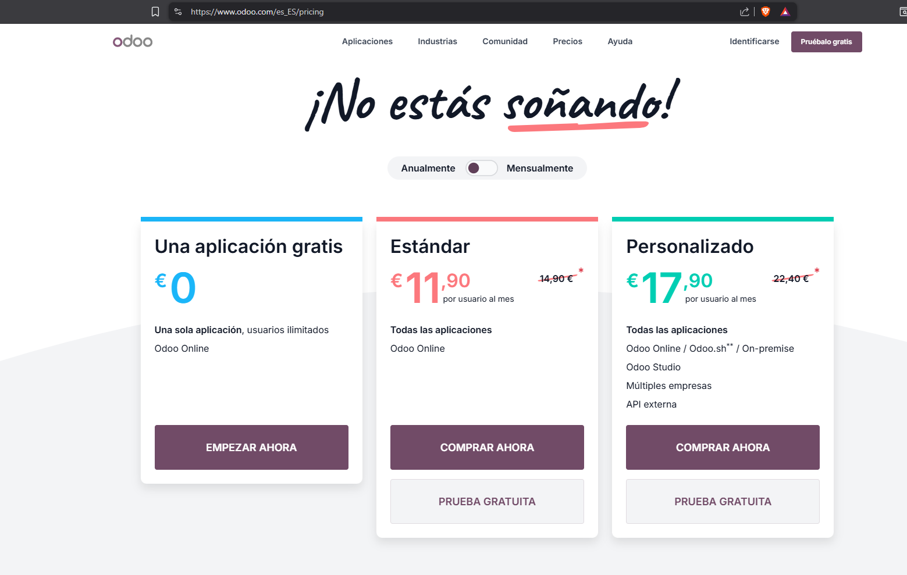
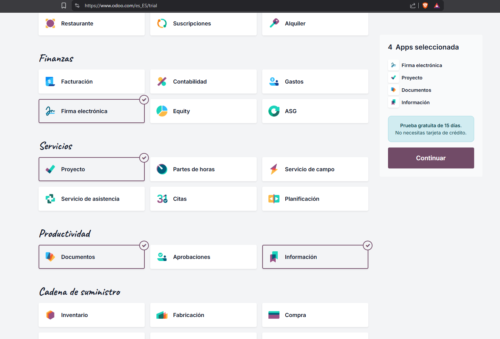
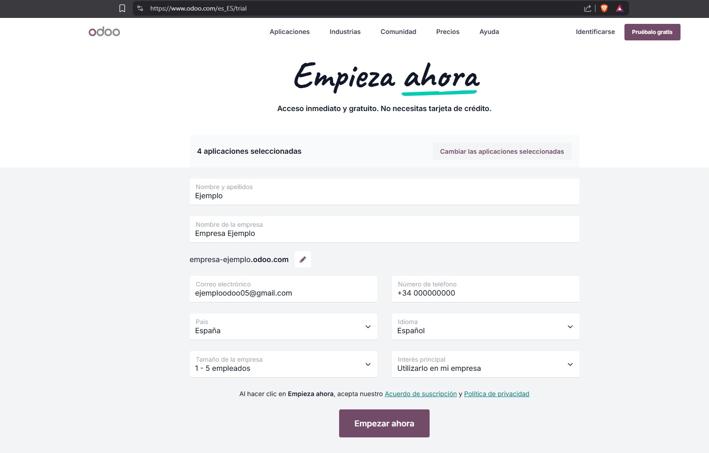
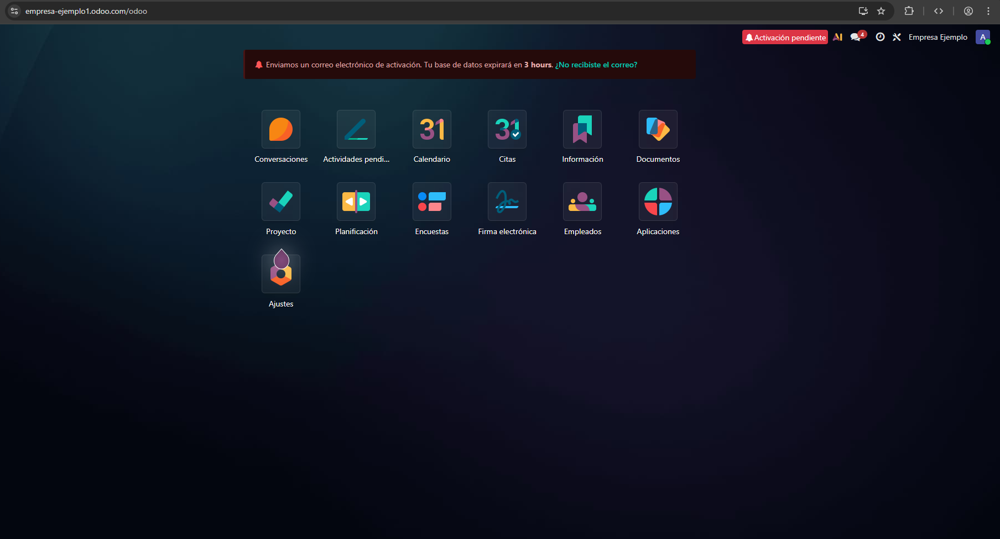
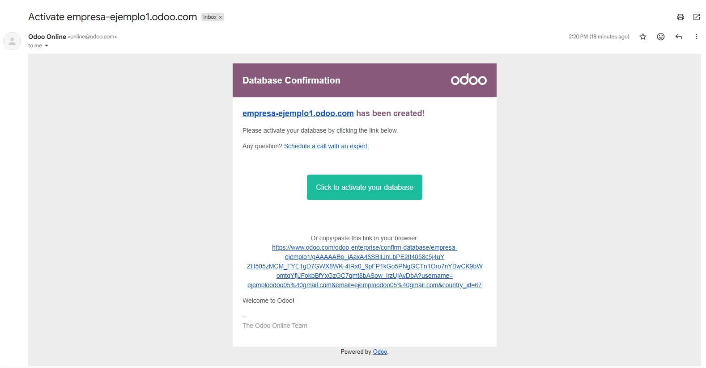
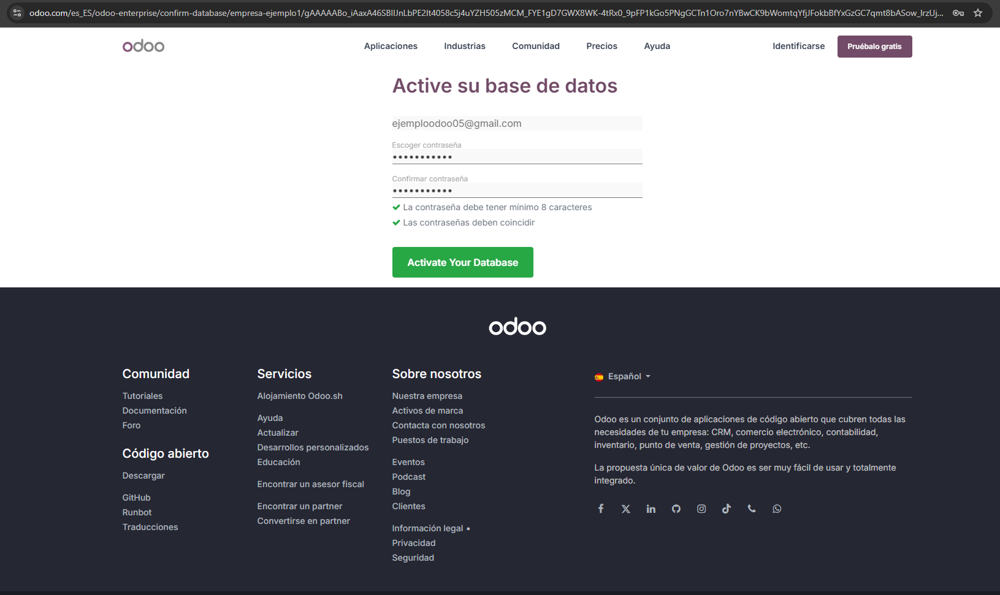
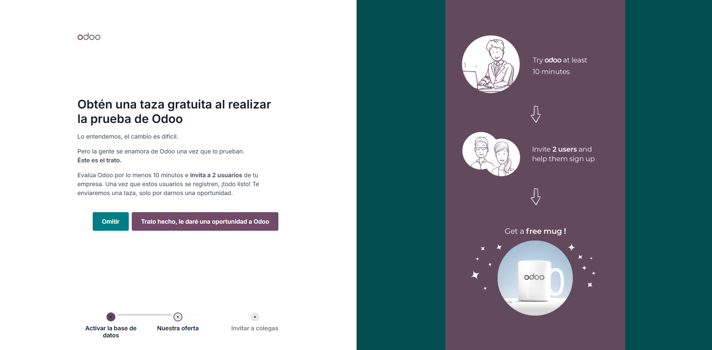
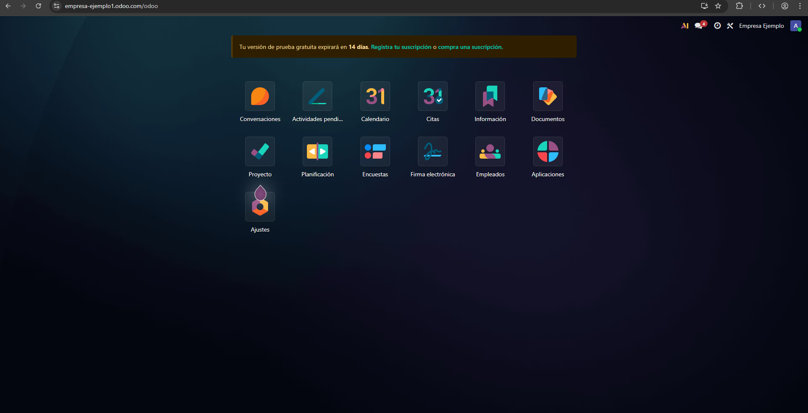

# 03 — Instalación y prueba (15 días) / Alta e instalación de apps

## Requisitos previos
- Navegador actualizado que **no** disponga de VPN ni de bloqueador de anuncios (Brave no es el adecuado).
- Cuenta de correo para alta.

## Pasos
1. Desde esta dirección [web](https://www.odoo.com/es_ES/pricing) escogemos la **prueba gratuita** del plan **Estándar**.

2. **Seleccionar apps iniciales** (máximo 10 en la prueba): CRM, Ventas, Facturación, Contabilidad, Proyectos, Documentos, Calendario, etc.

3. Posteriormente le damos a "**Continuar**" y nos solicitará nuestros datos. Los **rellenamos** y le damos a "**Empezar ahora**".

4. Nos da la **bienvenida** en un apantalla de carga durante unos segundos. Y nos aparecerá esta pantalla:

5. Nos dirigimos al **email** que nos han enviado para poder activar la **base de datos**. Sino, se borrará en 3 horas.

6. Creamos una **contraseña** y ya podremos **activar la base de datos**.

7. Seguimos los pasos que nos muestran a continuación:

- Primera pantalla: Nos dicen de adquirir una taza de Odoo.

- Segunda pantalla: Lo tenemos todo listo.

## Resultado esperado

- Acceso al panel principal con las apps instaladas:

