# 04 — Ajustes generales

## My Preferences

### A continuación se mostrarán ajustes dentro de la pestaña "My Preferences"

1. Para ir a los ajustes básicos de Odoo, pinchamos en nuestra foto de perfil en la esquina derecha superior y entramos en "**My Preferences**".

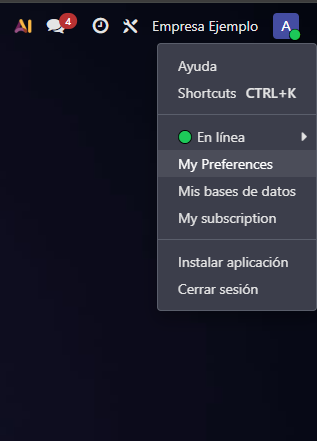

2. Una vez hayamos entrado se nos abre este cuadro, en el cual podemos ver nuestro nombre, email y le podemos poner teléfono y móvil de trabajo. Además nos encontramos varias pestañas, entre ellas la de **Preferencias**:

- En esta, podemos cambiar el **idioma** (se indicará cómo en los próximos pasos), cambiar la **firma de correo electrónico**, cambiar el **tema**, las **notificaciones** como indica, y poner un **PIN** que se utilizará para la entrada/salida del modo quiosco de la aplicación Asistencias

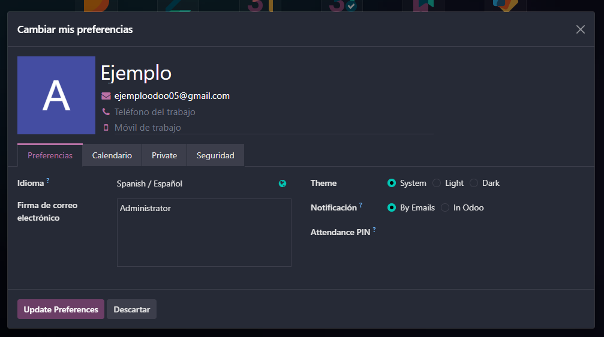

3. Podemos **cambiar el idioma**. Ahora mismo solo está el español, pero si le pulsamos al icono del planeta, le podemos añadir intuitivamente los idiomas que queramos. A continuación añadiremos el inglés de Reino Unido.

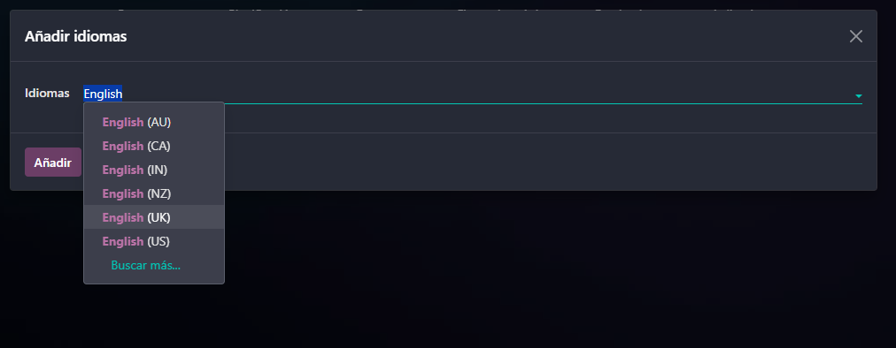

4. Una vez seleccionado y pulsado "**Añadir**" nos  aparecerá este mensaje:

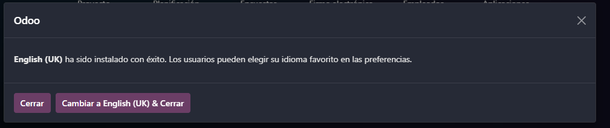

5. Ahora cuando queremos cambiar de idioma nos aparecerá el español y el inglés.

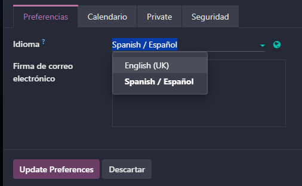

6. Es la pestaña **Calendario** nos encontramos con ajustes como la **zona horaria**, la **privacidad** del calendario, la opción de dejar un **mensaje** cuando no estás, y dejar tu **sitio de trabajo** de cada día (casa, oficina, etc.).

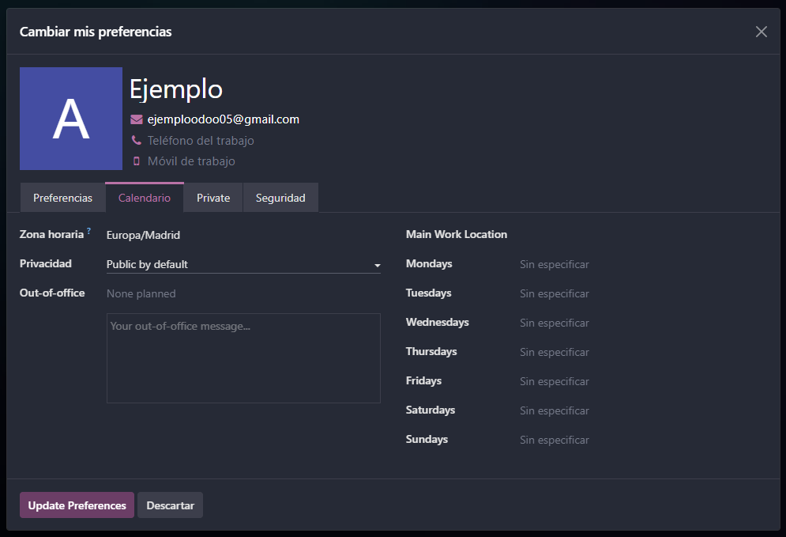

7. En la pestaña **Private** tenemos para poner **información privada** como nuestra **dirección**, **contacto de emergencia**, y **correo** y **número** privados.

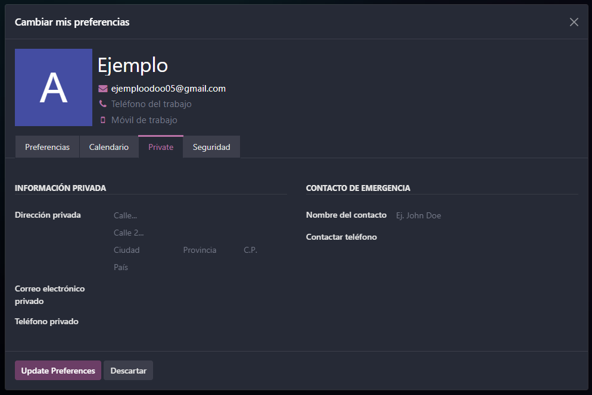

8. En la pestaña **Seguridad** tenemos ajustes como **cambiar contraseña**, **autentificación en dos factores**, **claves API**, **claves de acceso** y **dispositivos** en los que tenemos la **sesión iniciada**.

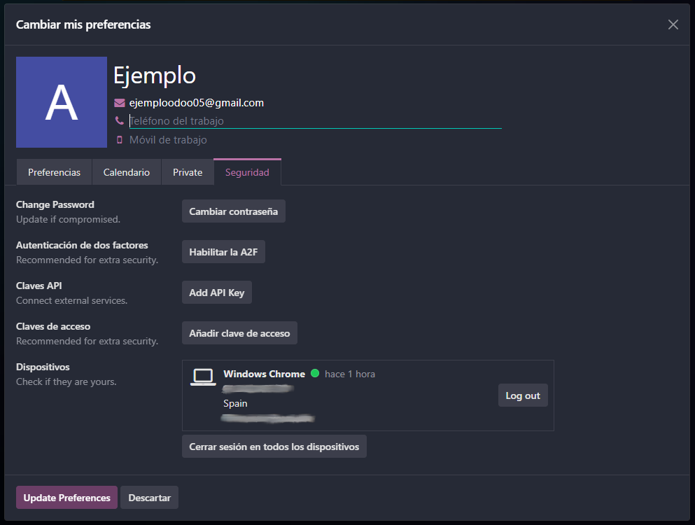

9. **Autenticación en dos factores**: Para activarla, una vez dado al botón de "**Habilitar la A2F**" nos aparecerá una pantalla para confirmar la contraseña. Acto seguido nos aparecerá otra con un **código QR**. El siguiente paso sería con una app de autenticación como **Google Authenticator** escanear ese QR y tener un código dentro de esa aplicación que se nos pedirá como segundo recurso al iniciar sesión.

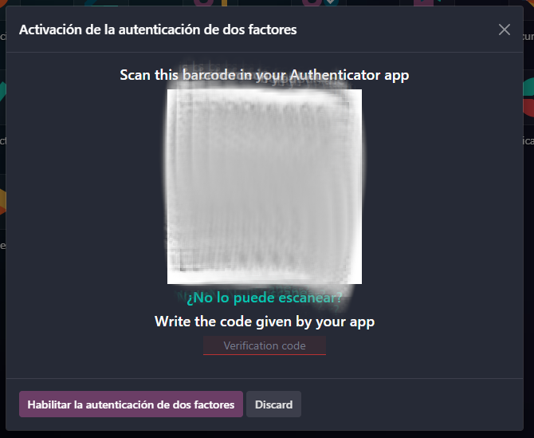

## Ajustes

### A continuación se mostrarán ajustes de usuarios y compañías dentro del icono "Ajustes"

1. Para ver los ajustes de usuarios y compañías, dentro de ajustes (pulsándole al icono de Ajustes o añadiéndole "/settings" a la URL) nos vamos dentro de **Usuarios y compañías** arriba a la izquierda. Depende a dónde le demos, veremos ajustes de usuarios o de compañías.

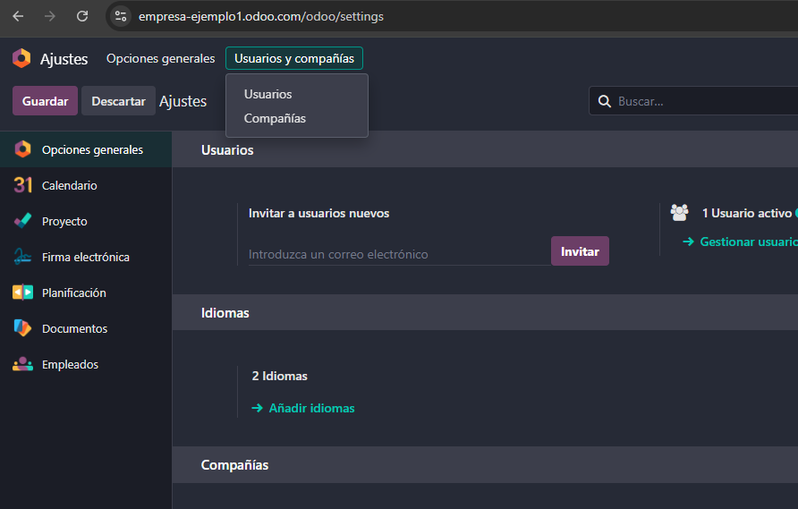

2. Dentro de **Usuarios** veremos una lista de los **usuarios registrados**, de momento uno:

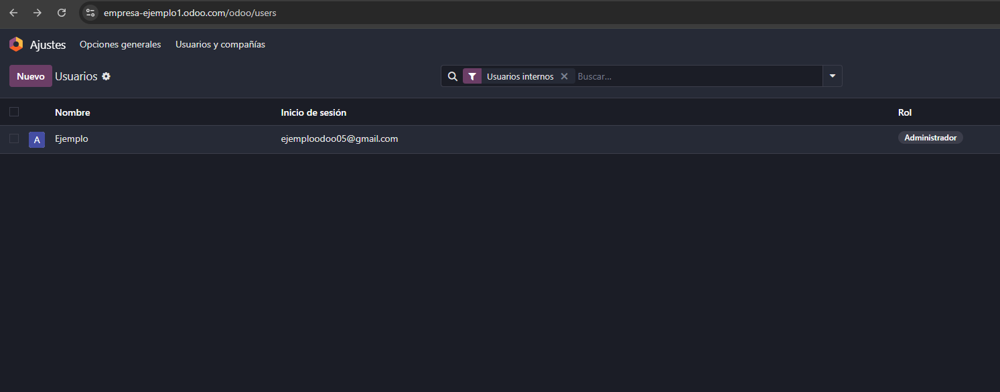

3. Le pulsado al usuario que tenemos, y nos aparecerá **información sobre él**:

- En roles podemos cambiar el **rol del usuario**.

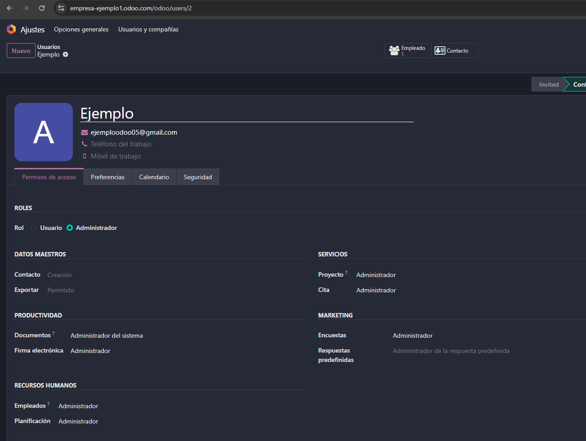

4. A continuación la vista de los ajustes de la compañía, solo hay una por el momento:

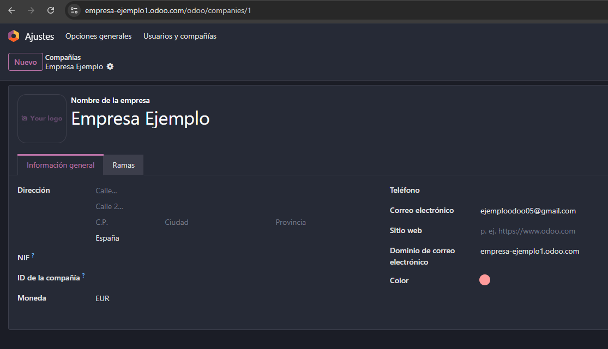

### A continuación se mostrarán opciones generales dentro del icono "Ajustes"

1. En el apartado de **idiomas** podemos volver a cambiar/instalar el idioma.

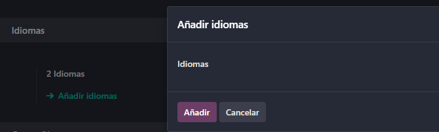

2. En el apartado **Compañías**, en **"Configurar diseño de documento"** podeos cambiar el diseño de la plantilla de factura.

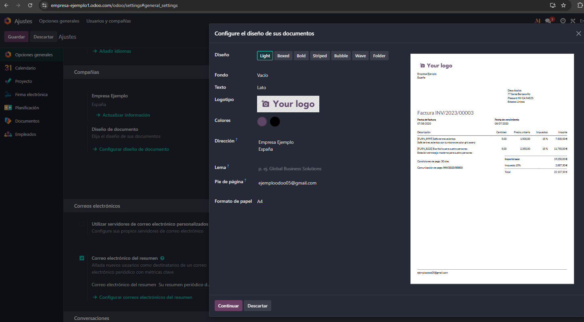

3. En el apartado de **Correos electrónicos**, en la opción de "**Configurar correos electrónicos del resumen**" podemos enviar email con determinada periodicidad.

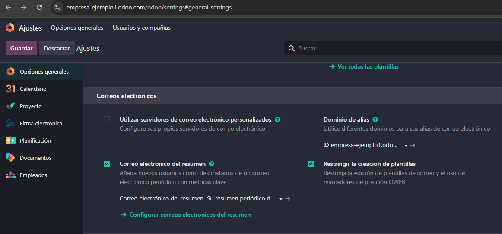

4. Nos aparecen una **lista** de **correos de resumen**, de momento solo uno:

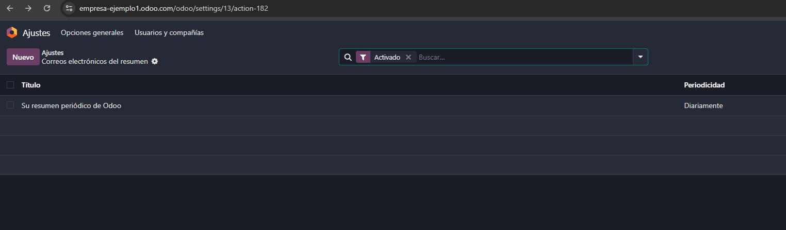

5. Si le pulsamos al correo, nos aparecerá su **configuración**, entre ella la opción de manejar su **periodicidad**. Podemos elegir hasta trimestralmente.

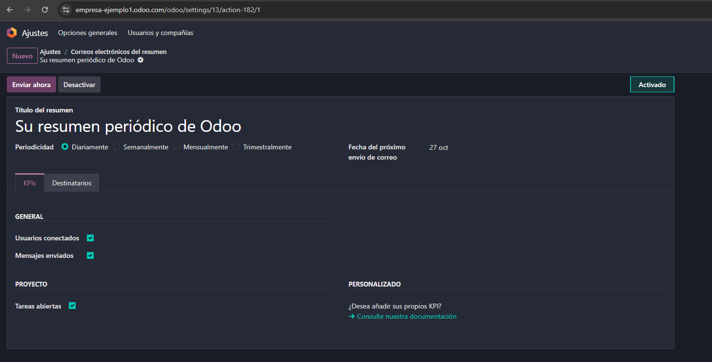
