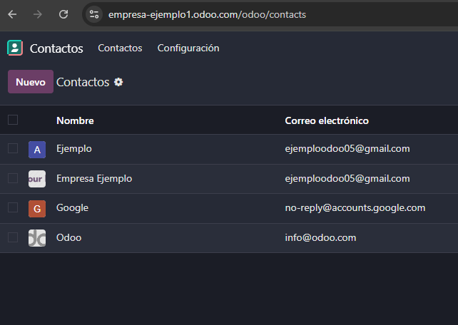

# 05 — Integración con Gmail (OAuth GCP + Add-on)

## Requisitos
- Cuenta Google Cloud (GCP).

## Pasos a seguir

1. Activamos "**Plugin de correo**" en la sección "**Integraciones**" de opciones generales de ajustes. Esto para poder usar plugins de Odoo en Gmail:

- Importante darle después a **Guardar**.

2. En el panel del lateral derecho, en el símbolo "**+**" nos aparecerá los plugins para instalar en Gmail. Acto seguido buscamos "**Odoo Inbox Addin**" y procedemos a instalarlo.

3. Nos aparecerá Odoo en el mismo panel lateral derecho, lo pulsamos y cuando abramos un email, nos aparecerá esto:

4. Nos pide que **conectemos la base de datos**, así que ponemos el dominio de nuestro sitio de Odoo.

- Tras darle a **login**, nos pedirá que le demos permisos a Gmail para acceder a la base de datos. Le decimos que sí.

5. Una vez hecho esto, nos aparecerá **información de la compañía** que nos ha enviado el email.

6. Para vincular Odoo con Gmail, primero debemos irnos a ajustes, en la misma sección que en el primer paso. Activamos la opción de **Autenticación OAuth**. Acto seguido pulsamos guardar.

7. Una vez guardado se nos debería aparecer un nuevo desplegable que aparece en la imagen del paso anterior: "**Proveedores OAuth**". Le pulsamos. Y nos aparece una lista de proveedores:

8. Le pulsamos a Google OAuth

9. Tenemos que rellenar el **ID de cliente**. Para ello nos vamos a ir a [Google Cloud console](https://console.cloud.google.com/), donde lo vamos a vincular con Odoo y vamos a crear un nuevo proyecto.

- Primero le damos a "**My First Project**" (puede aparecer con otro nombre), y en la ventana nueva, le damos a "**Proyecto nuevo**"

10. Le ponemos el **nombre del proyecto**, sin tocar el campo de ubicación. Acto seguido le damos a **Crear**.

11. Una vez tengamos el proyecto creado, se nos redirigirá a esta pantalla, en la cual **buscaremos "gmail"** y pulsaremos a "**Gmail API**"

12. Procedemos a **habilitar la API**

13. Nos redirige a esta pantalla de detalles. Acto seguido le damos a "**Crear credenciales**", a la derecha, en el cuadro rectangular gris:

14. Nos encontramos este formulario para la **credencial**. Seleccionamos lo que está en la imágen: **Gamil API** y **Datos de los usuarios**. Le damos a siguiente.

15. El siguiente paso es ponerle un **nombre a la aplicación**, en este caso es el mismo que en el proyecto recientemente creado. **El correo de asistente** del usuario será el nuestro, al **igual que en el de desarrollador**.

16. Ahora nos pide que le demos **permisos**, es opcional, le damos los que queramos. Bajamos el scroll y le damos a "**Actualizar**". Por último, más abajo "**Guardar y continuar**".

17. En el siguiente paso vamos a poner que el **tipo de la aplicación** sea **web**, escogemos un **nombre**, y en **URIs de redireccionamiento** autorizados ponemos el siguiente:

- el_dominio_de_la_empresa_en_odoo **/google_gmail/confirm**
- si mi empresa es **https://empresa-ejemplo1.odoo.com 
- mi URI sería **https://empresa-ejemplo1.odoo.com/google_gmail/confirm

Procedemos a **Crear**.

18. Nos dan **nuestras credenciales**, y finalmente le damos a "**Listo**".

- No hace falta que copiemos ni descarguemos nada de momento.

19. Nos dirigimos a "**Credenciales**" en el menú lateral de la izquierda. Entramos al que acabamos de crear. En mi caso "**odoo email**".

20. Copiamos el **ID de cliente**, en "**Additional information**".

21. Volvemos al **proveedor Google OAuth**, pegamos el **ID de cliente**, marcamos "**Permitido**" y le damos al icono de la nube para **guardar**.

22. Volvemos a **ajustes**, en **opciones generales**, en la sección de **correos electrónicos**, habilitamos "**Utilizar servidores de correo electrónico personalizados**", se nos aparecerá la opción de "**Usar un servidor de Gmail**", en el ID pegamos el** ID de cliente** que habíamos copiado anteriormente, y en "Secreto" pegamos el "**Secreto de cliente**" que aparece poco más abajo del ID de cliente en la credencial que creamos. Muy importante **guardar**.

23. Para **comprobar**, desde el plugin que agregamos anteriormente en Gmail, vamos a **agregar un contacto**, en este caso, **Google**. Primero comprobamos los contactos que tenemos:

24. Desde un email que nos envió Google, **le añadimos a contactos con el plugin**.

25. Volvemos a comprobar los contactos y vemos que **se agregó Google**.

