# 06 — Contactos

## Pasos a seguir

1. Desde el panel principal, nos dirigimos al **módulo de contactos**. Si no lo tenemos, habrá que instalarlo, para ello se explica en el punto [03-instalacion](03-instalacion.md#instalar-aplicaciones).

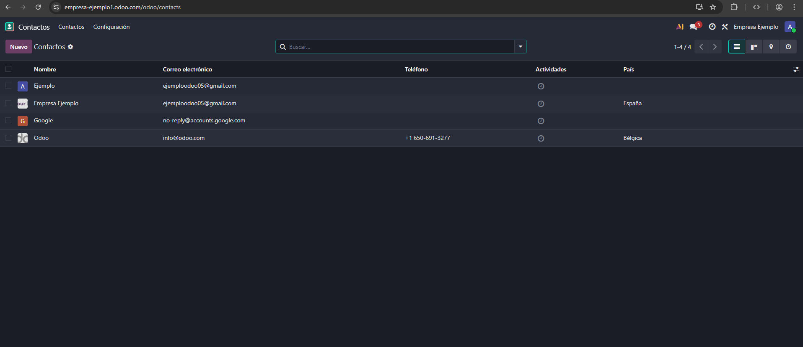

2. Le pulsamos a un contacto que tengamos, por ejemplo el de Odoo. Vamos que nos aporta mucha **información** sobre la empresa.

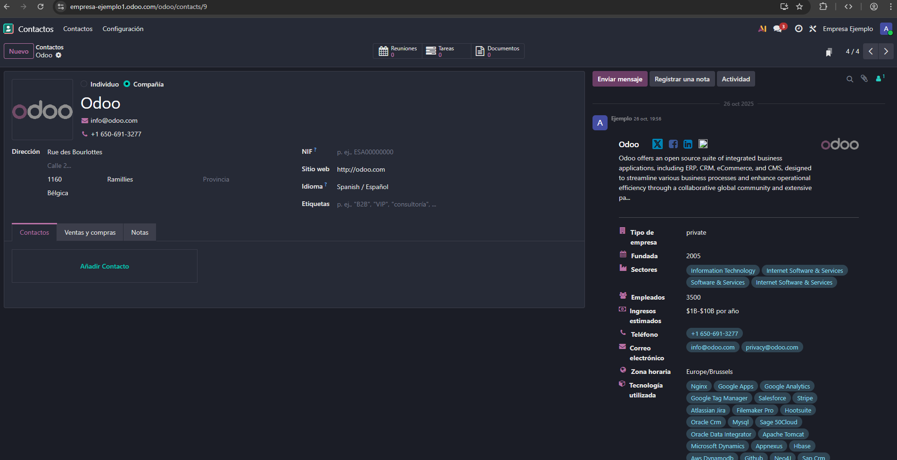

3. En "**Etiquetas**", si escribimos una, y le damos a crear, estaremos creando una y a la vez **asignándosela al contacto**.

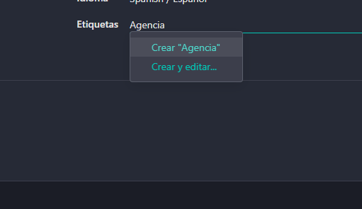

O, desde **configuración**, entramos en "**Etiquetas de contacto**"

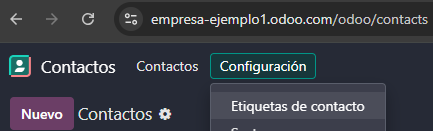

Desde ahí le pulsamos a "**Nuevo**" (exactamente donde en la imagen pone "Guardar"), escribimos la nueva etiqueta y **guardamos**. También en la parte de la derecha se puede cambiar el **color** de la etiqueta.

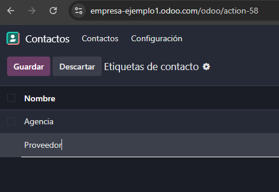

4. También podemos **filtrar**: por **personas, compañías**, etc. En el ejemplo de la imagen se filtra por **etiquetas**.

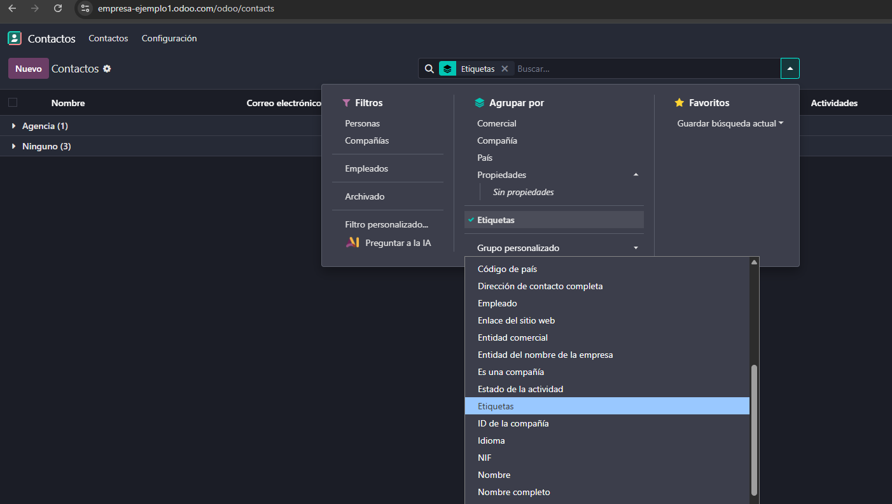

5. Si **seleccionamos** uno o varios contactos, veremos las **acciones** que podemos llevar a cabo: exportar, insertar en hoja de cálculo, duplicar, eliminar, entre otras muchas opciones.

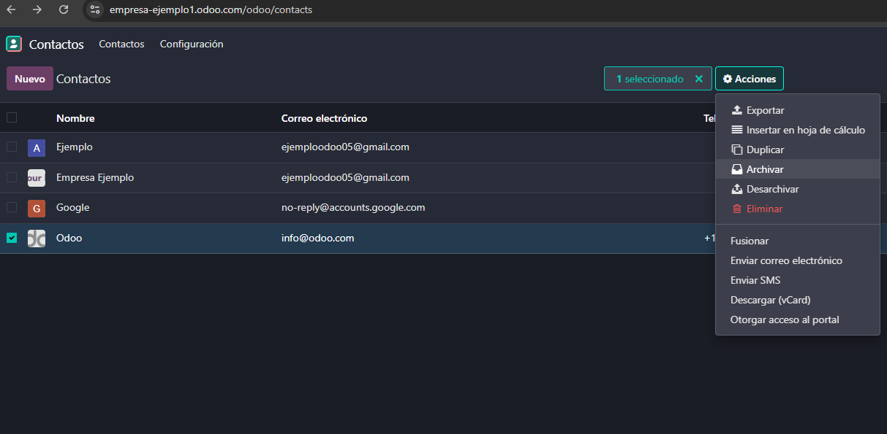

6. Si volvemos a la página de un **contacto**, podemos **programar actividades**, asignar quién está a cargo de ese contacto, agregar notas, etc.

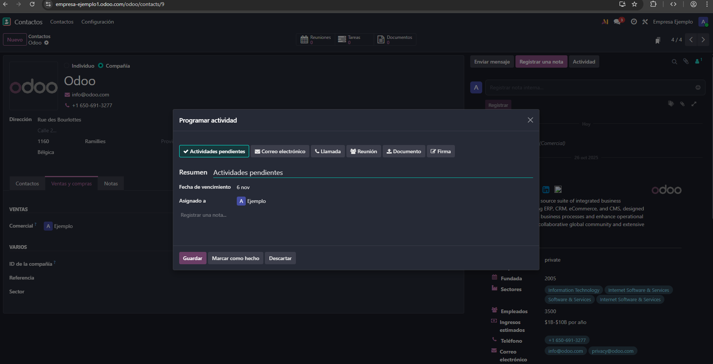

7. Seguir o no a un contacto dependerá si queremos que nos lleguen notificaciones sobre ese contacto: si lo seguimos nos llegarán.

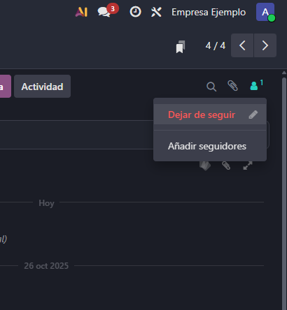

8. Para importar contactos, es necesario entrar a esta página desde la la opción **Importar registros** del icono de tuerca.

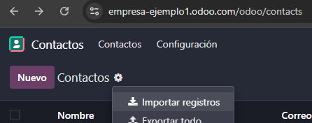

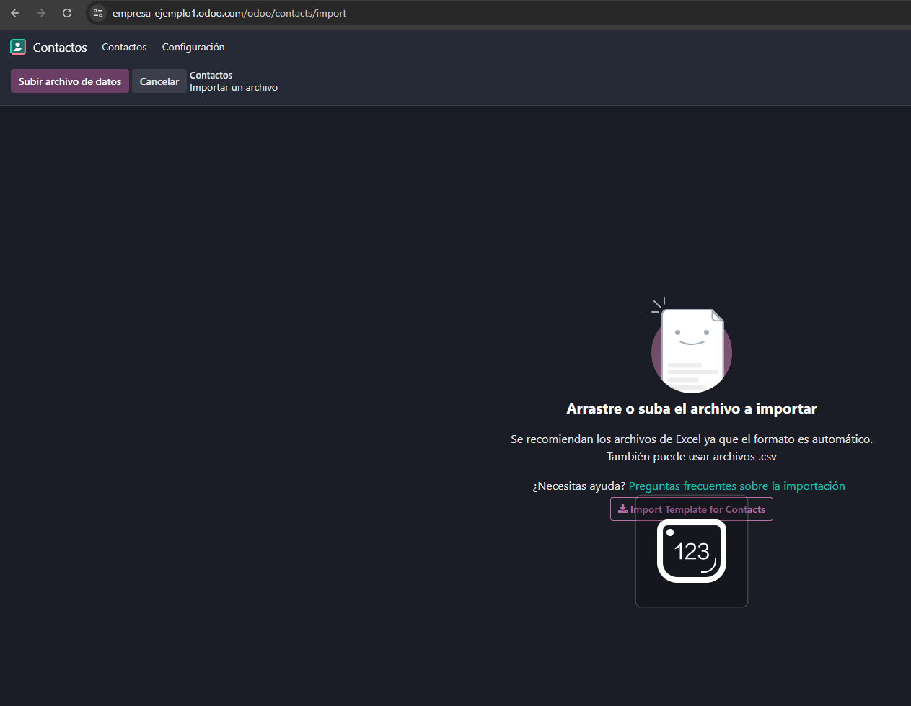

9. Si le damos a **Import Template for Contacts** se nos descargará un archivo CSV con una plantilla de cómo debería de ser el Excel para poder importar los contactos.

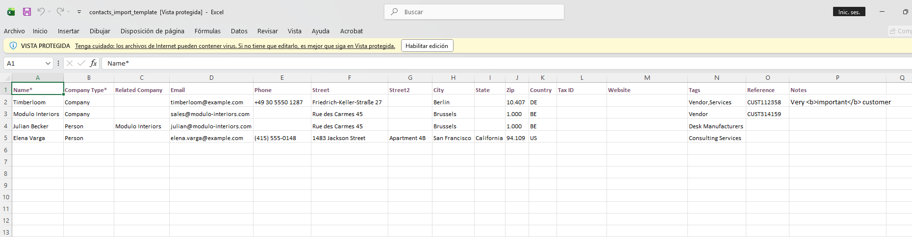

10. Desde [assets/files/](../assets/files/importar_contactos.csv) hay un archivo CSV de ejemplo para importar el contacto. Pulsamos sobre **"Subir archivo de datos"**. Subimos el archivo y nos aparecerá esta pantalla, los datos se han completado automáticamente a los **campos de Odoo**, excepto el de país, en ese tenemos que seleccionar el campo de país, y en el lado izquierdo, seleccionamos el formato de fecha y hora.

Acto seguido le damos a **"Probar"**, nos dirá que todo está válido, y procedemos a "**Importar**".

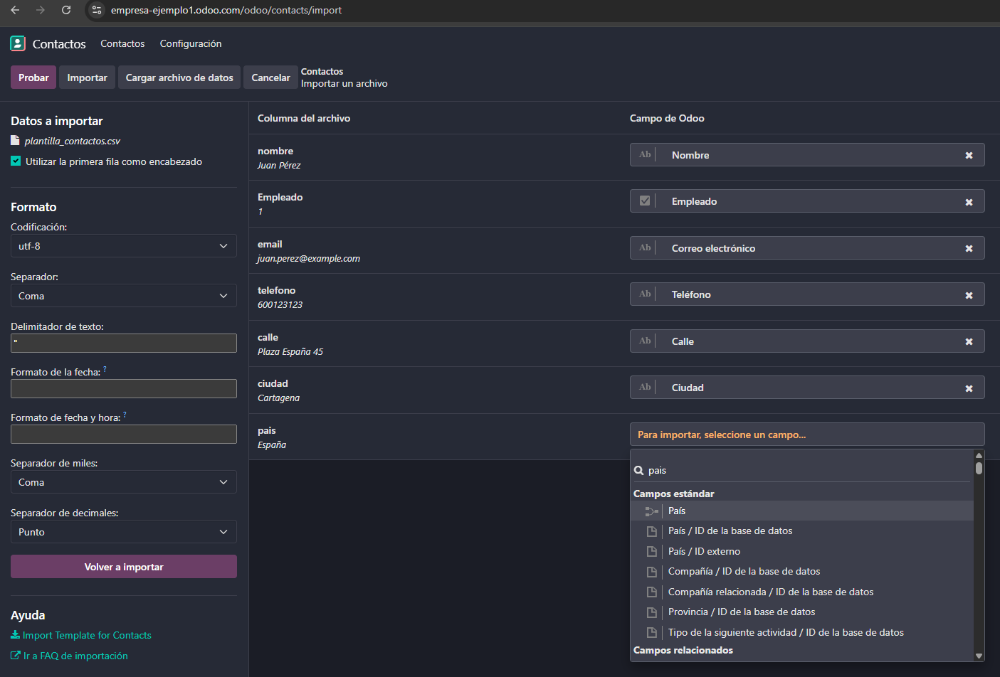

11. Nos aparecerán los **contactos que hemos importado**. Si nos vamos a la página principal de contactos, nos aparecerán todos incluido el recientemente creado.

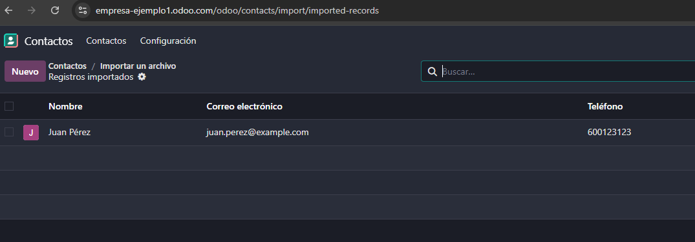

12. Para que los usuarios tengan **acceso al portal**, es decir, para que puedan descargarse sus facturas, agilice documentación...

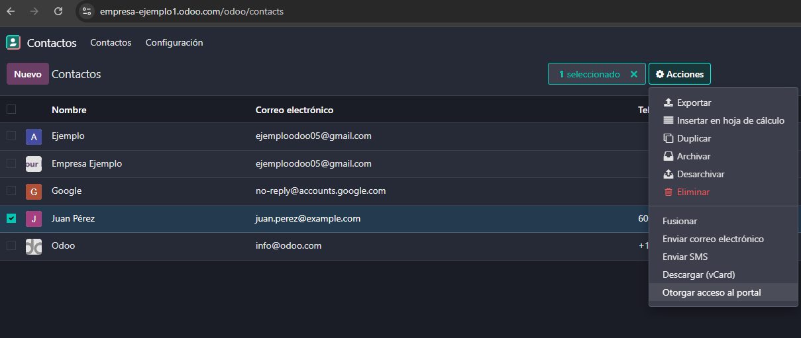

13. Le pulsamos sobre **otorgar acceso** y lo tendría, nos aparecería después opción para quitarle el acceso y volverle a invitar.

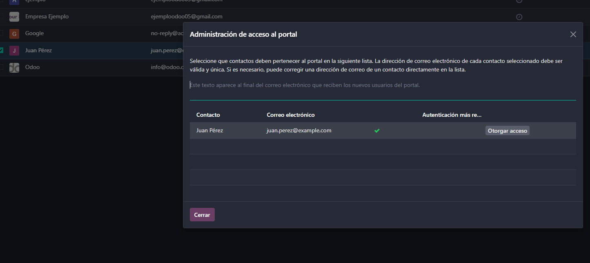

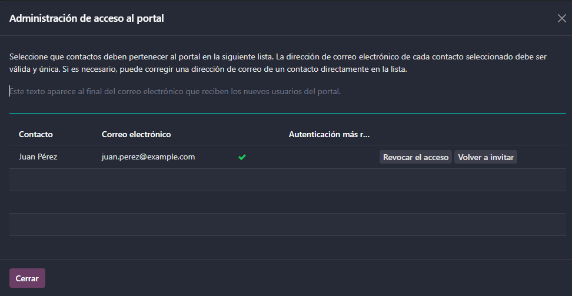
