# 08 — Proyectos (Kanban)

## Índice

- [Creación de proyecto, etapas, tareas y subtareas](#creación-de-proyecto-etapas-tareas-y-subtareas)
- [Vistas](#vistas)
- [Actividades](#actividades)
- [Tareas recurrentes](#tareas-recurrentes)
- [Dependencias de tareas](#dependencias-de-tareas)
- [Hitos](#hitos)
- [Calificación de cliente](#calificación-de-cliente)

## Creación de proyecto, etapas, tareas y subtareas

1. Entramos al módulo de **Proyecto** y empezaremos con crear uno dándole a "**Nuevo**" en la esquina superior izquierda.

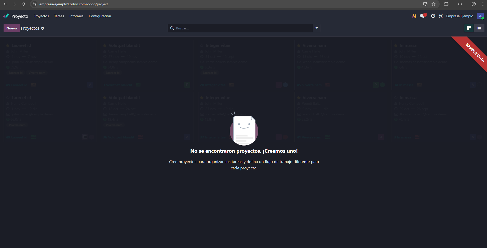

2. Le asignamos un **nombre** y lo **creamos**. También le podemos asignar un alias si quisiéramos.

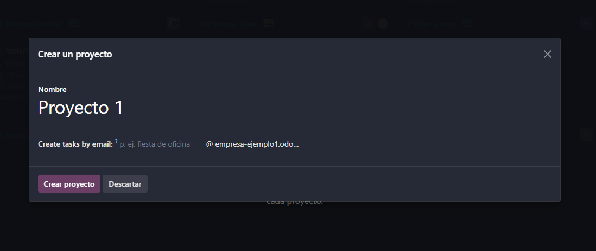

3. Una vez creado, podemos crear las **etapas** del proyecto:

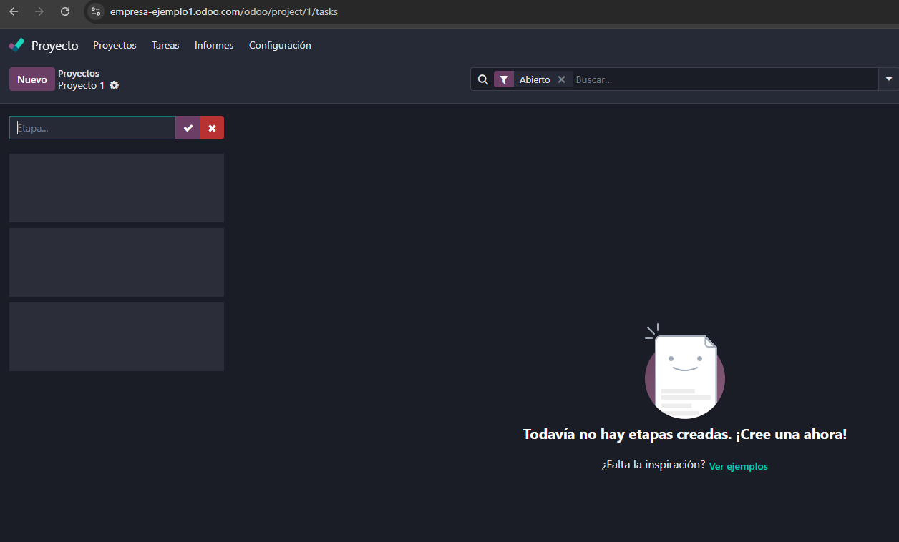

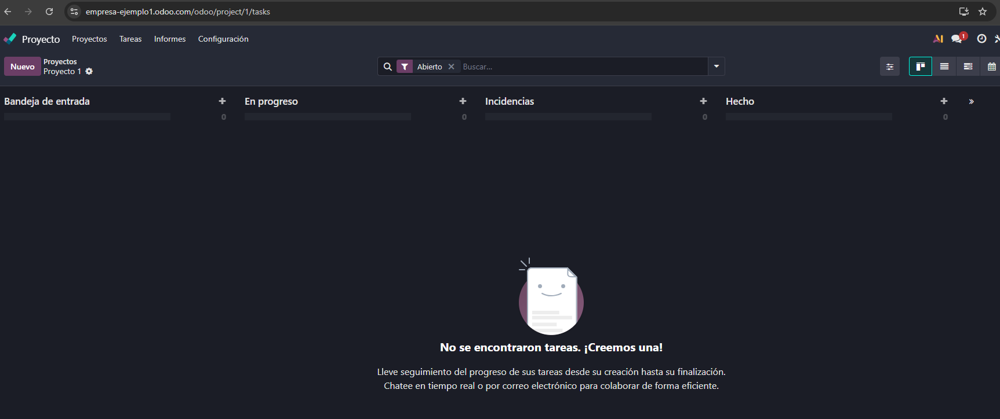

4. A cada etapa, le podemos **añadir tareas** pulsándole al **icono de añadir**. Le asignamos un título, quiénes están asignados y finalmente a "**Añadir**".

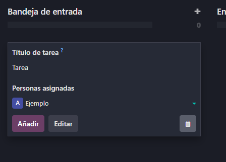

5. Una vez creada la tarea, si **pulsamos sobre ella** podemos **editarla**. Podemos cambiar el nombre, asignar a más personas, ponerle etiquetas, seleccionar una prioridad, al cliente que va dirigido la tarea, fecha límite, una descripción. Podemos añadir subtareas y además filtrarlas, incluso en el botón "**Ver**" podemos hacer lo mismo que en la tarea e incluso añadir subtareas.

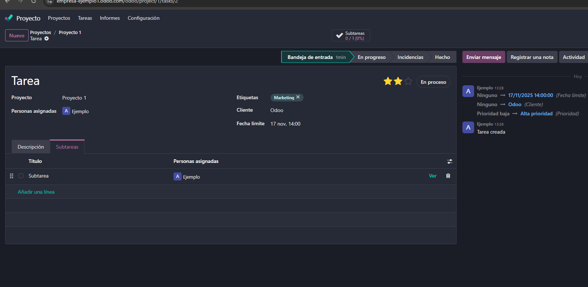

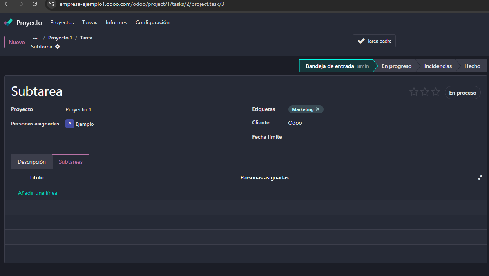

6. Podemos **cambiar de etapa**, o bien manualmente desde editar o bien **arrastrándola** de esta manera entre las etapas.

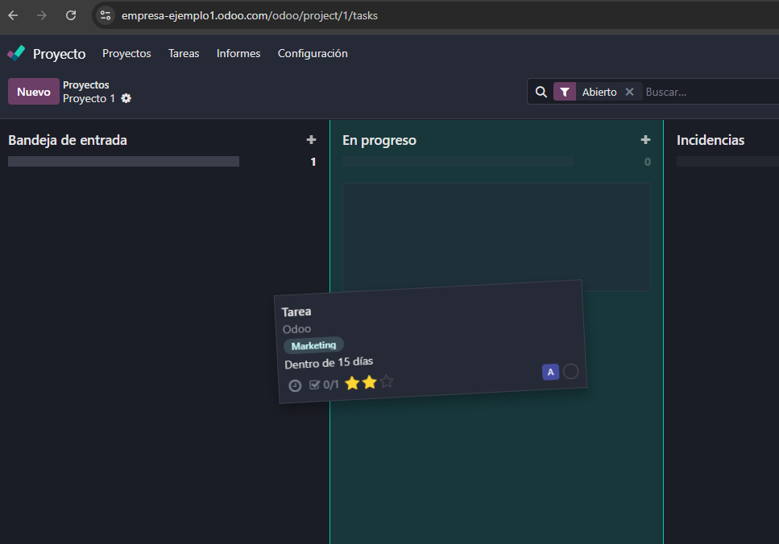

## Vistas

7. Si nos vamos a la página principal del módulo de Proyecto, veremos nuestros proyecto, en la esquina superior derecha veremos para **cambiar la vista** de Kanban a Lista.

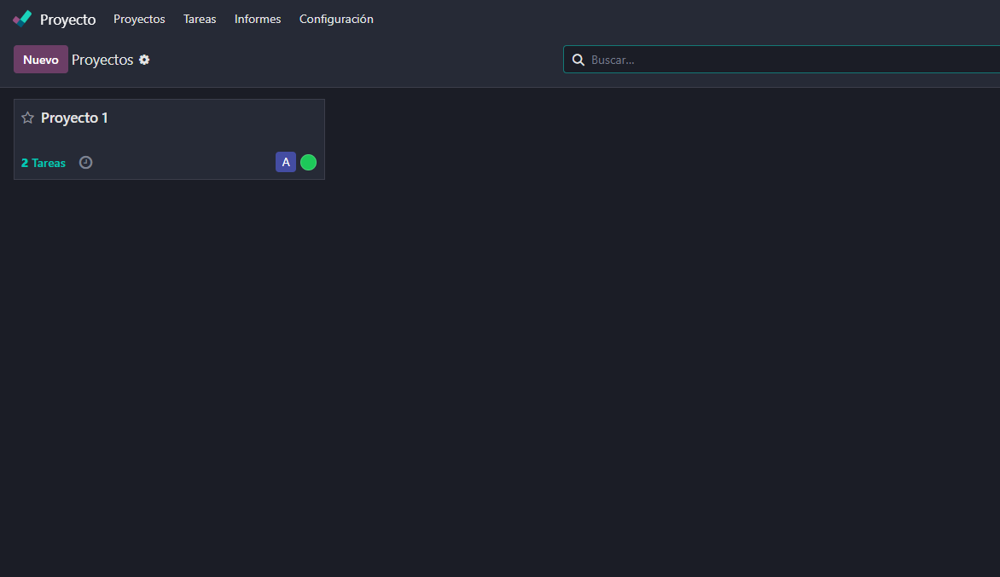

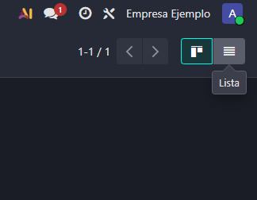

Además si nos vamos a continuación al apartado de **tareas**.

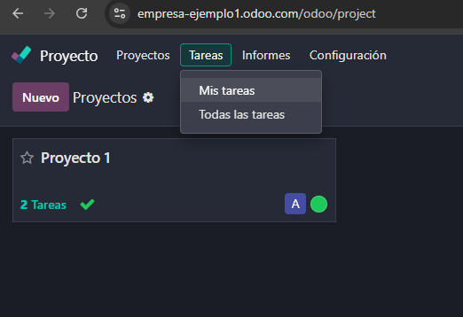

Nos aparecerá todas las tareas, y podemos **cambiar las vistas** en las opciones de la esquina superior derecha. Por ejemplo la de calendario.

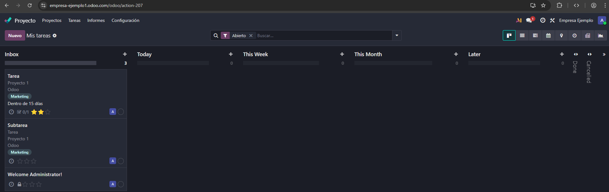

Nos aparece las **tareas** pero **distribuidas en un calendario**, totalmente independiente al del módulo Calendario, aquí **solo aparecen las tareas**, nada de eventos ni reuniones propias del otro módulo.

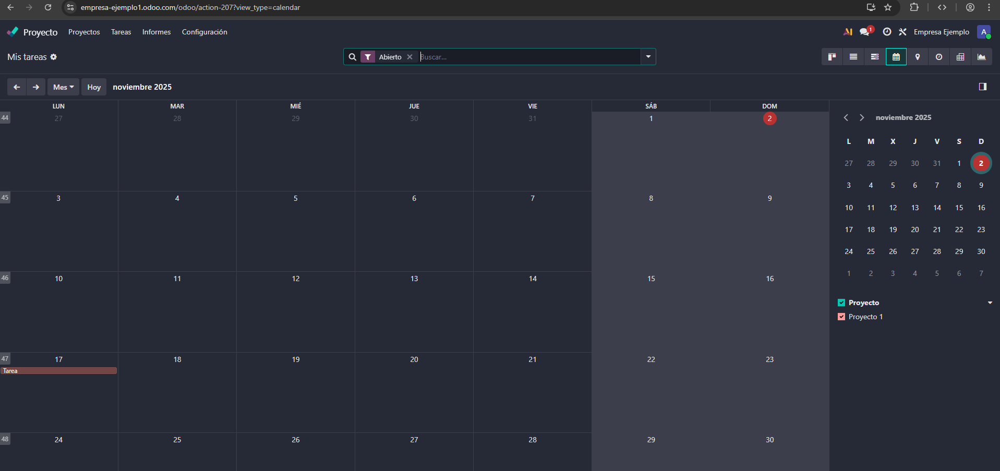

## Actividades

8. Si nos vamos a la tarjeta de nuestro proyecto, podemos ver las **actividades** asociadas con él. Ahí podemos programar más actividades.

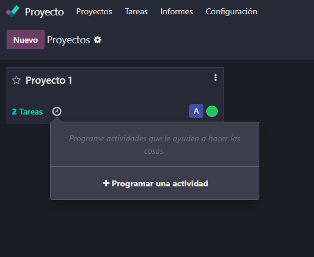

9. Podemos **programar una actividad** según que se vaya a hacer, le podemos poner fecha límite, a quién va asignado, una nota. Finalmente lo **guardamos** o marcar como hecho.

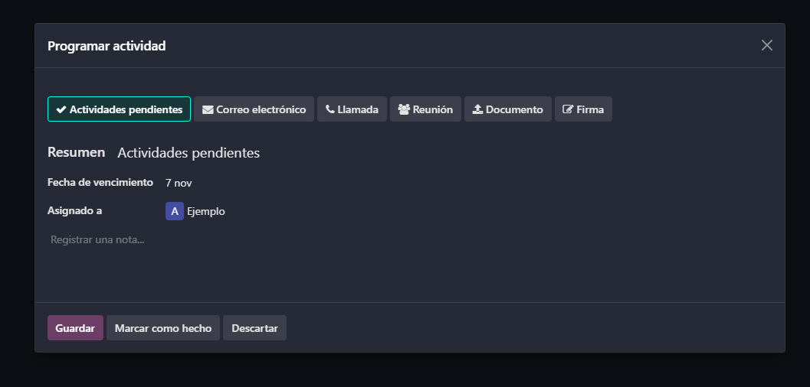

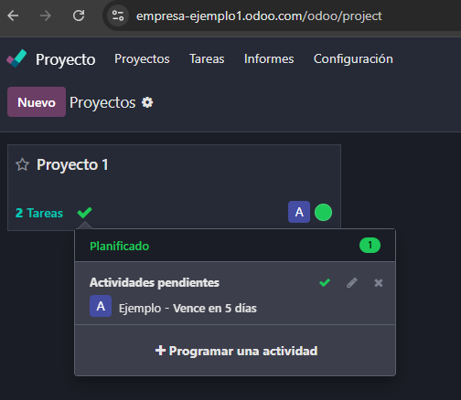

10. También podemos hacer lo mismo para las **tareas**. En este caso le daré a "**Marchar como hecho**".

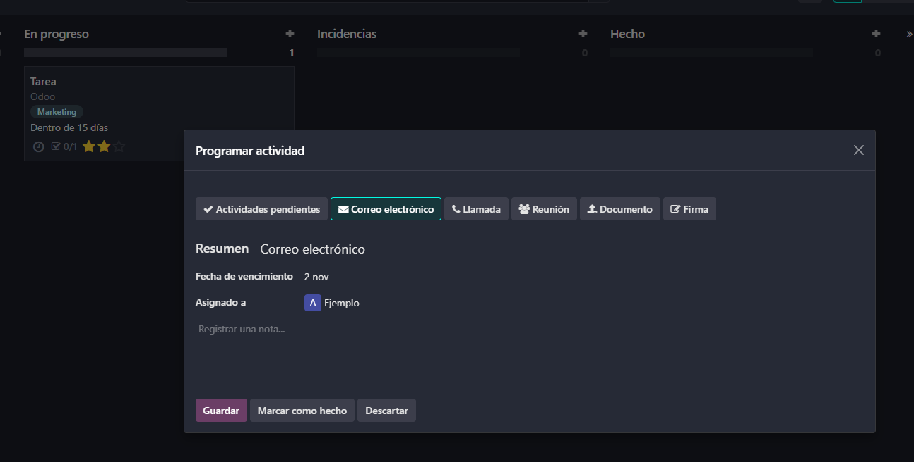

11. Dentro de la tares, veremos la **actividad**.

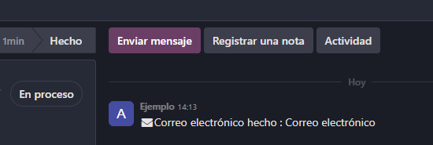

## Tareas recurrentes

12. También podemos hacer que una **tarea** sea **recurrente**, es decir, que se repita cada cierto tiempo. Para ello, desde los tres puntitos del proyecto, nos dirigimos a **ajustes**, nos aparecerá los ajustes del proyecto. Y pulsamos sobre ajustes al lado de descripción y bajamos hasta la opción "**Gestión de tareas**", marcamos la opción de **tareas recurrentes**. Se **guarda automáticamente**, también podemos guardarlo manualmente desde el icono de arriba de la nube.

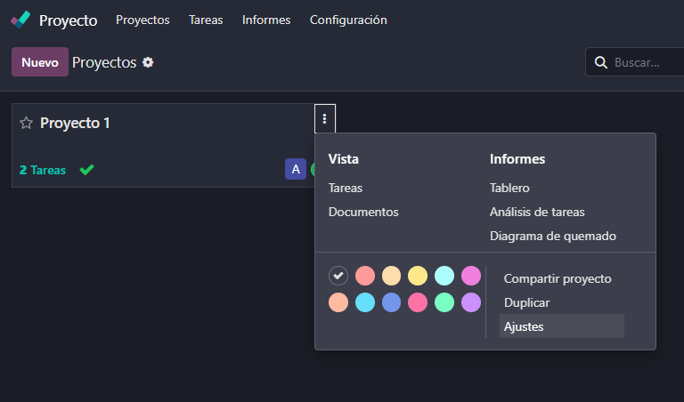

13. Si nos dirigimos a una tarea, nos aparece un **icono nuevo** de **marcar como recurrente**, si le pulsamos nos aparece para repetir cada cierto tiempo hasta una fecha determinada.

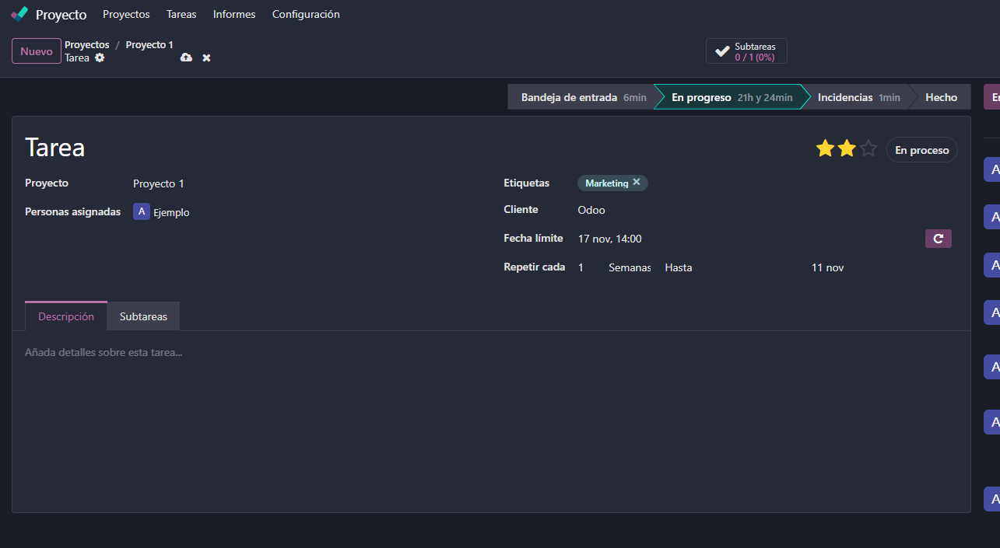

## Dependencias de tareas

14. Podemos hacer que una tarea no se puedo empezar hasta que otras no terminen y esté en **estado de espera**. Para ello, volviendo a los ajustes del proyecto en "**Gestión de tareas**" como bien se ha mostrado en el [punto 12](#tareas-recurrentes), marcamos la opción de "**Dependencia de tareas**". Acto seguido vamos a crear una nueva tarea y entramos dentro de ella.

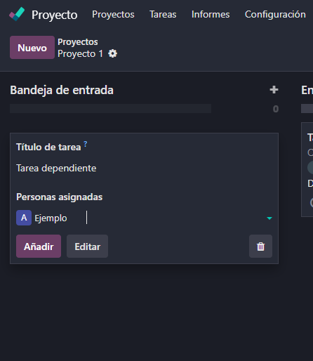

15. Nos aparecerá una nueva sección llamada "**Bloqueado por**". Aquí añadiremos las tareas que se tienen que completar para que podamos hacer esta tarea dependiente. Le damos a "**Seleccionar**".

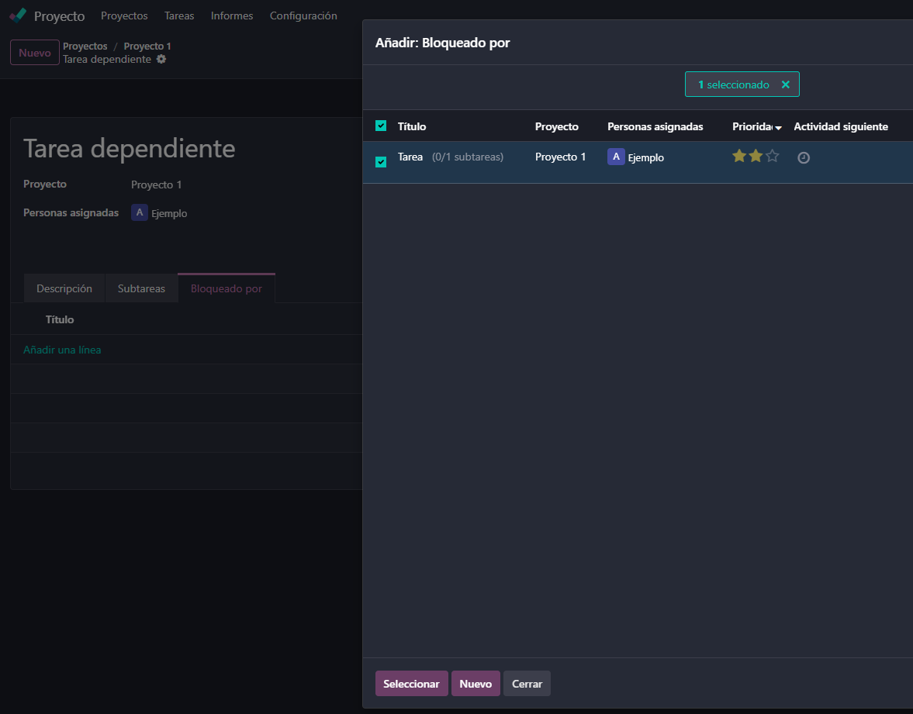

16. Ahora la tarea pasa a estar **en espera**:

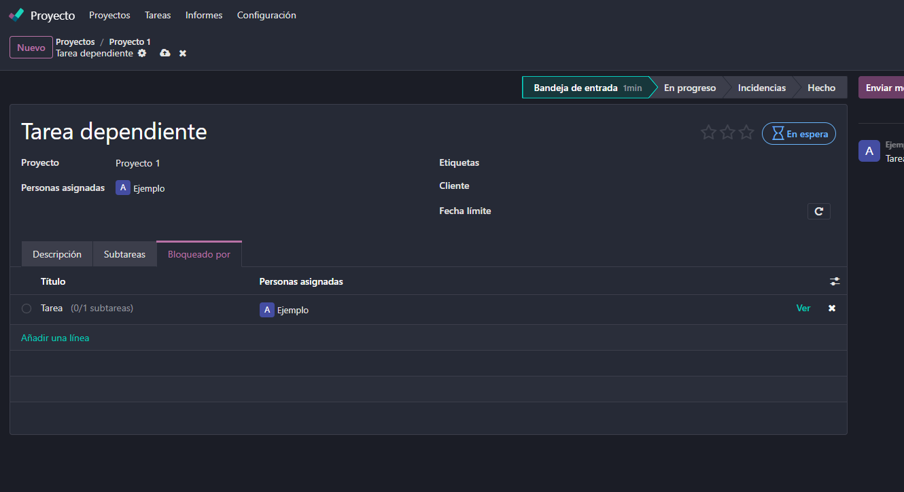

## Hitos

17. Los hitos representan entregas clave dentro de un proyecto, que permiten planificar, seguir y evaluar el progreso. Cada hito puede estar asociado a varias tarea. Para ello, volviendo a los ajustes del proyecto en "**Gestión de tareas**" como bien se ha mostrado en el [punto 12](#tareas-recurrentes), marcamos la opción de "**Hitos**". Y si nos vamos a una tarea del proyecto, podemos agregarle un hito.

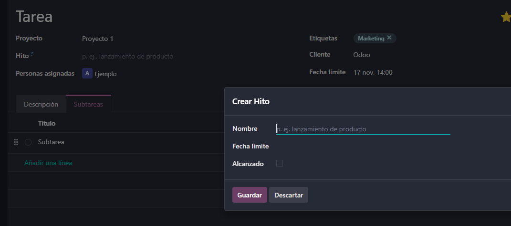

## Calificación de cliente

18. El cliente recibirá automáticamente una solicitud de calificación por correo cuando su ticket llegue a la etapa que tiene la plantilla de correo configurada. Para ello, entraremos desde el panel principal a **Aplicaciones** e instalaremos un nueva llamada "**Servicio de asistencia**".

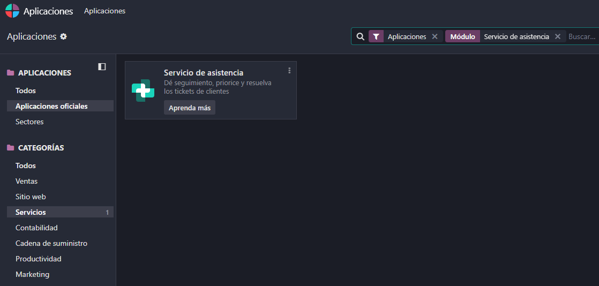

19. Entramos al módulo recientemente instalado y nos vamos a **Configuración > Equipos de servicio de asistencia**.

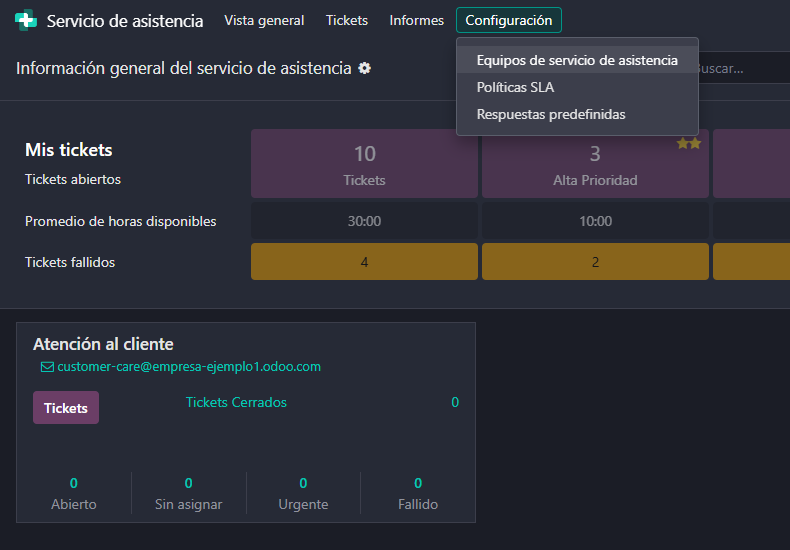

20. Nos dirigimos al equipo de atención al cliente.

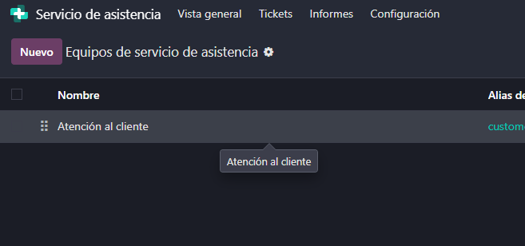

21. Bajamos hasta la sección de **rendimiento** y marcamos la casilla de **Calificación de clientes**.

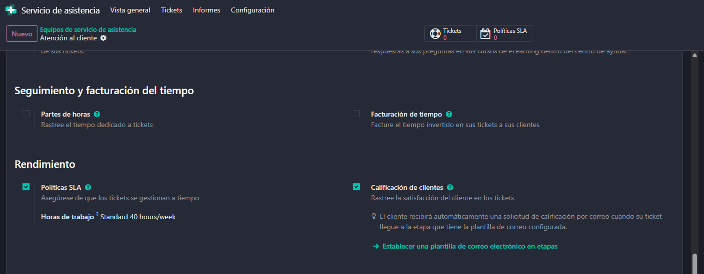
