# 09 — Documentos, Firma e Información (Knowledge)

## Índice

- [Módulo Documentos](#módulo-documentos)
- [Módulo Firma electrónica](#módulo-firma-electrónica)
- [Módulo Información](#módulo-información)

## Módulo Documentos

1. Nos dirigimos al módulo de **Documentos**. Podemos observar que ya tiene una **estructura organizada** por los módulos en general, también el proyecto que creamos anteriormente tiene su propia carpeta

2. Nos vamos a ir por ejemplo a la carpeta del proyecto creado en el punto anterior, y vamos a **subir el archivo** con el que importamos los contactos con el que trabajamos anteriormente en el punto de contactos.

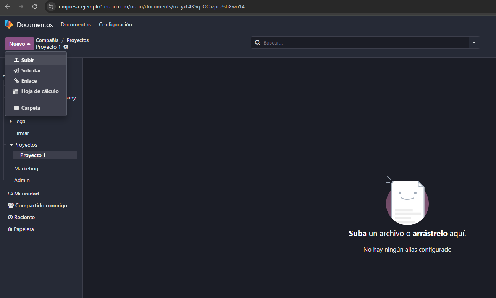

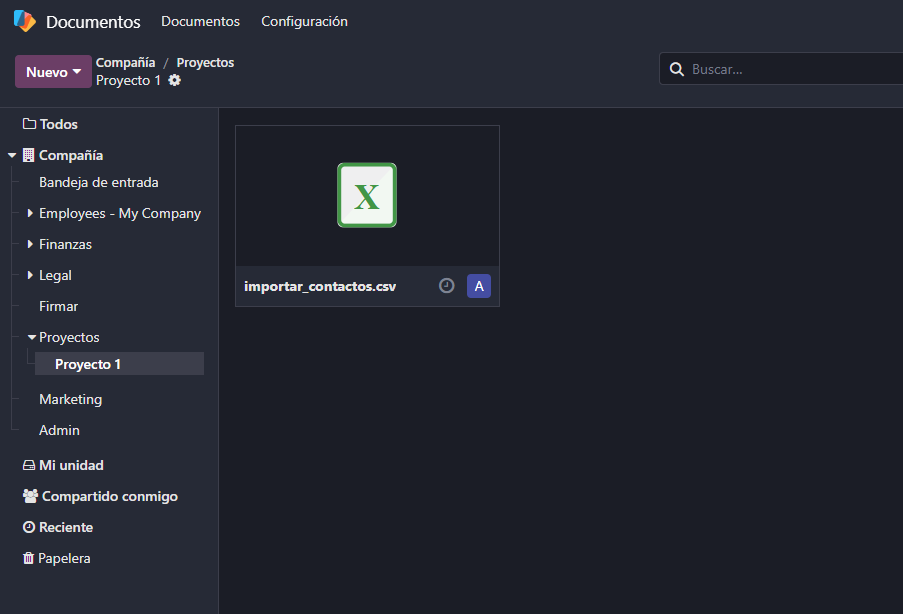

3. Nos sale este cuadro para abrirlo desde **hojas de cálculo de Odoo**.

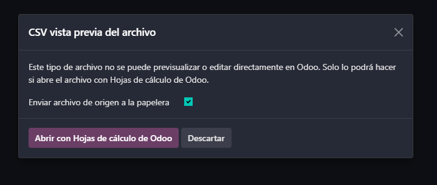

4. Nos aparece las **hoja de cálculo de Odoo**, en ella podemos **trabajar desde el mismo Odoo** y evitar problemas de compatibilidad con otras aplicaciones, de esta manera todos los integrantes de la empresa trabajan dentro de Odoo.

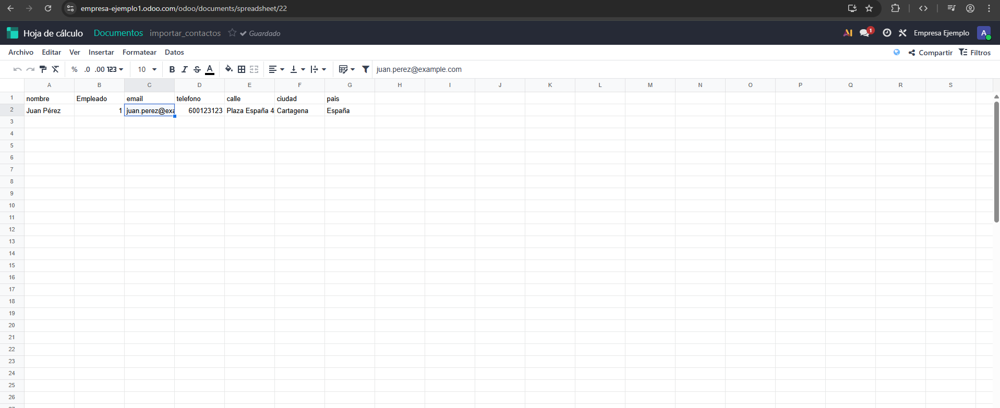

5. Volviendo a Documentos, subimos un PDF cualquiera, lo seleccionamos **pulsando en la parte del nombre**, si pulsamos en la parte de la imagen del PDF nos aparecerá una vista previa de este, y en la esquina superior derecha justo debajo del icono del perfil, le pulsamos al **icono de información**, y podremos editar **información** sobre el PDF. Desde nombre, propietario y contactos hasta **añadirle etiquetas**, registrar notas y actividades. Lo mismo le ocurren a los otros tipos de archivos.

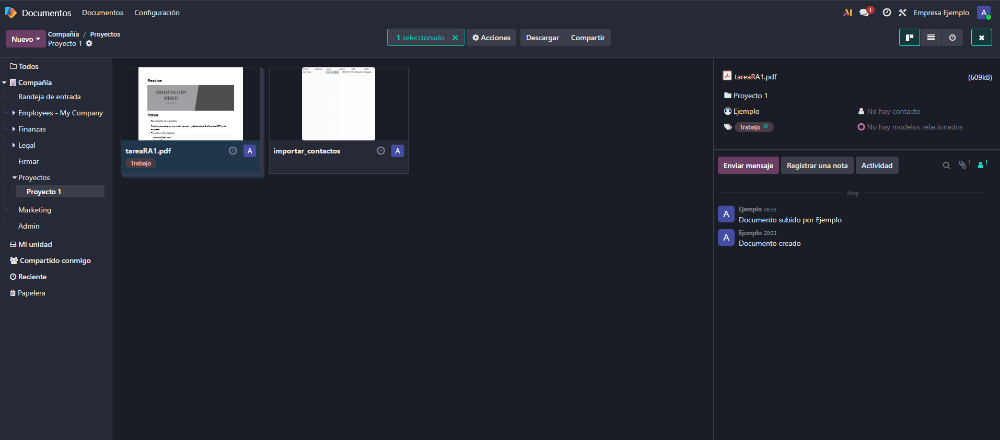

6. Si le pulsamos arriba a **Acciones**, tenemos más opciones como **dividir el PDF**.

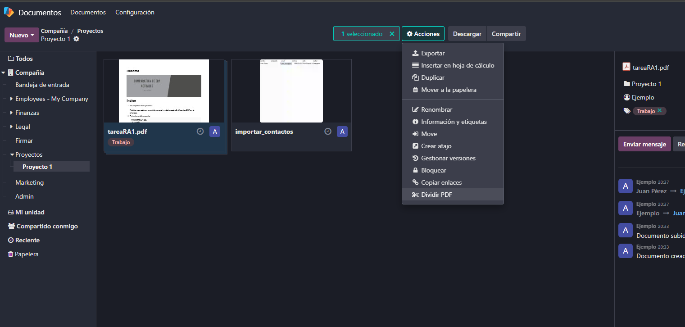

7. Si le pulsamos, nos aparecerá esta pantalla para **dividirlo**. El corte se hará **sobre cada tijera**, en mi caso dividiré el PDF en dos partes. Le damos a **Dividir** arriba a la izquierda.

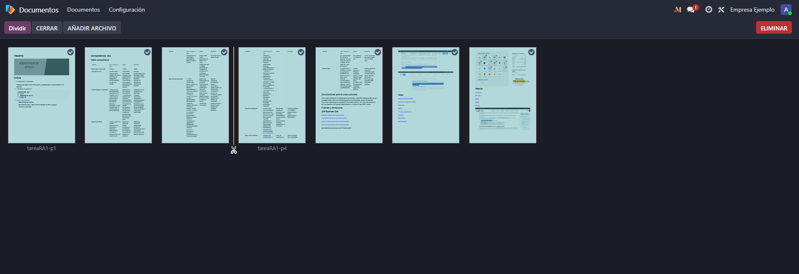

8. Finalmente **nos lo divide**.

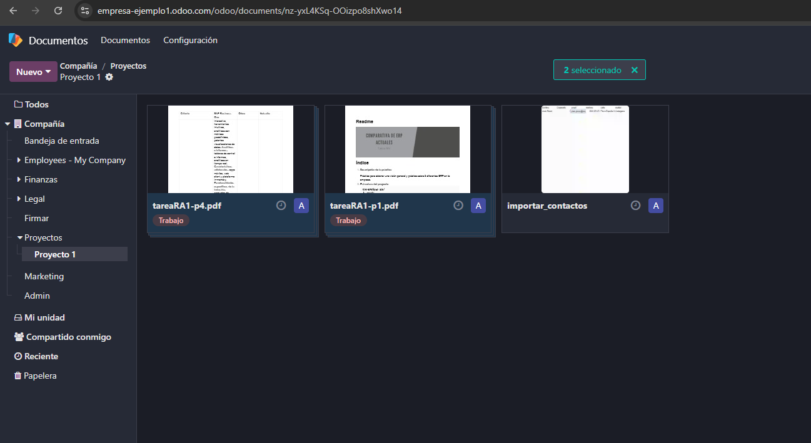

## Módulo Firma electrónica

9. Este módulo de **Documentos** podemos **vincularlo** al módulo de **Firma electrónica**. Pulsamos sobre "**Pruebe un ejemplo de contrato**".

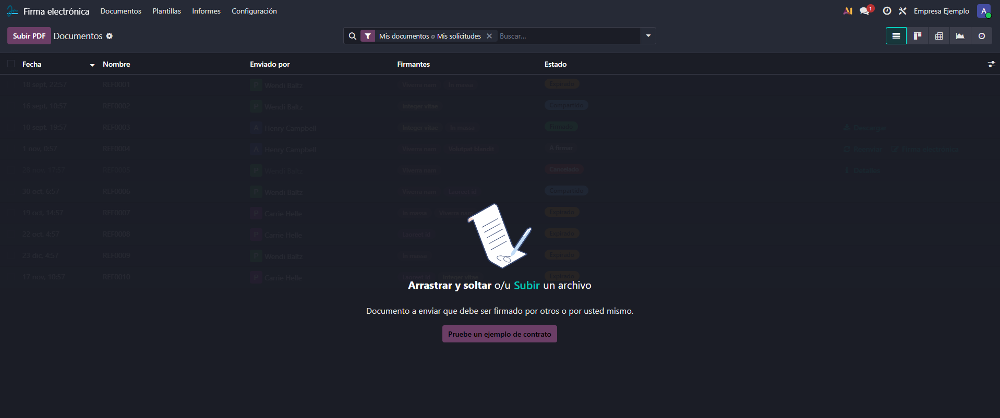

10. Nos aparece esta vista, en el **panel de la derecha** podemos **agregar** distintos **campos** como nombre, fecha, firma, texto, teléfono, casillas, etc. **arrastrándolos**. En mi caso he añadido nombre, fecha y firma.

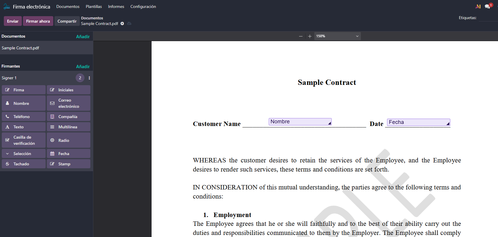

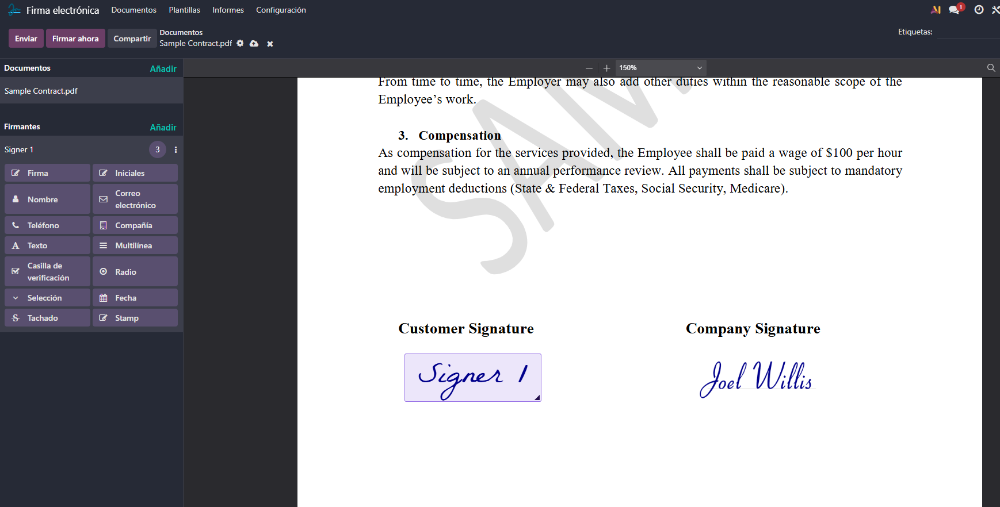

11. Si le damos al botón de **Enviar** situado arriba a la izquierda nos aparecerá el siguiente cuadro a rellenar. A quién va dirigido para firmar, hasta cuándo es válido... Se lo enviaría a esa persona y lo firmaría. En este caso lo descartamos.

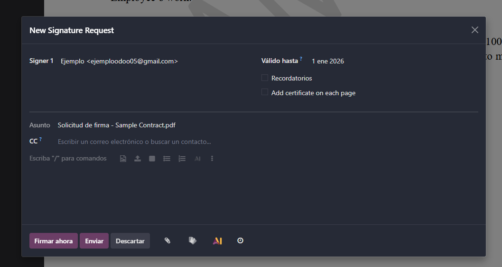

12. Si le damos al lado del botón de Enviar a **Firmar ahora**, nos aparecerá lo siguiente para proceder a firmar.

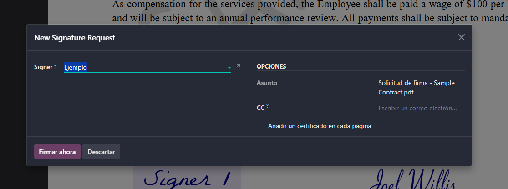

13. Nos pedirá que hagamos click a cada campo que agregamos en anteriores pasos **para rellenarlos**. El nombre y la fecha se llenan automáticamente y la firma nos saldrá la opción de una por defecto (la que aparece en la imagen), para dibujar a mano y para subirla desde el ordenador. Cuando acabemos, le pulsaremos al pequeño botón que hay abajo del todo de **Validar y enviar documento completado**.

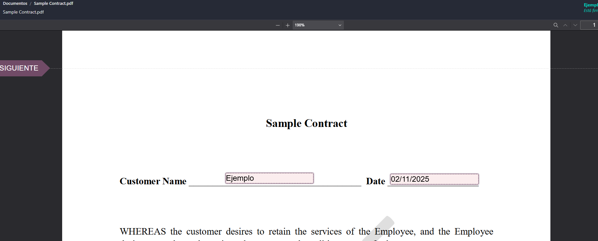

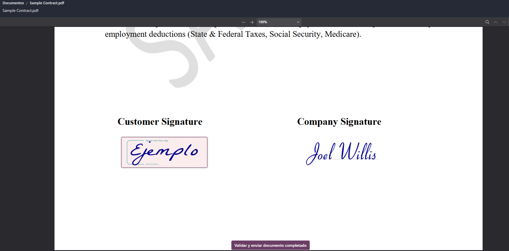

14. Nos saldrá un mensaje de que se **firmó correctamente** y la opción para **descargar**, además nos enviarán un **email** confirmando que hemos firmado el documento. Además nos aparecerá en **Firma electrónica** el contrato como **firmado**.

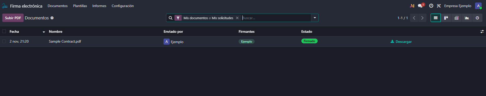

## Módulo Información

15. Finalmente veremos el módulo de **Información**. Este módulo sirve para almacenar información, datos de la empresa, configuración básica, etc. Empezamos abriendo este módulo. Nos encontramos con un artículo de defecto. Este módulo funciona por espacios de trabajo, así que a la izquierda podemos crear uno.

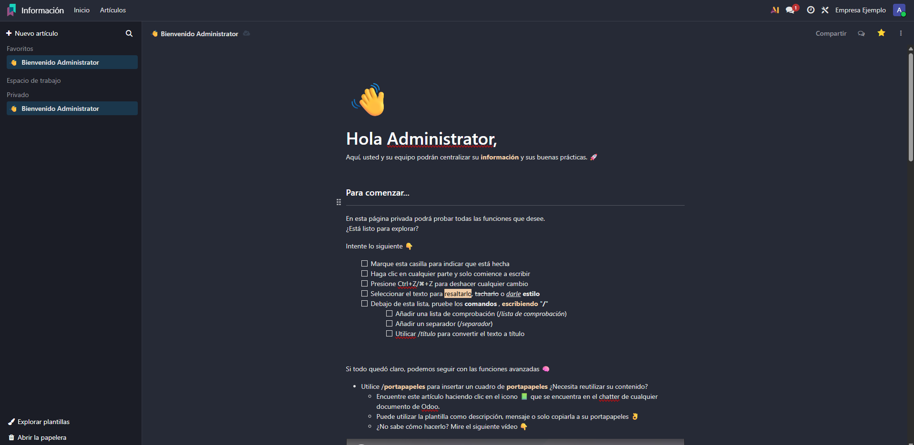

16. Una vez **creado**, le asignamos un título, además le he añadido una portada con las opciones que hay en los tres puntos de la derecha justo abajo del icono de perfil.

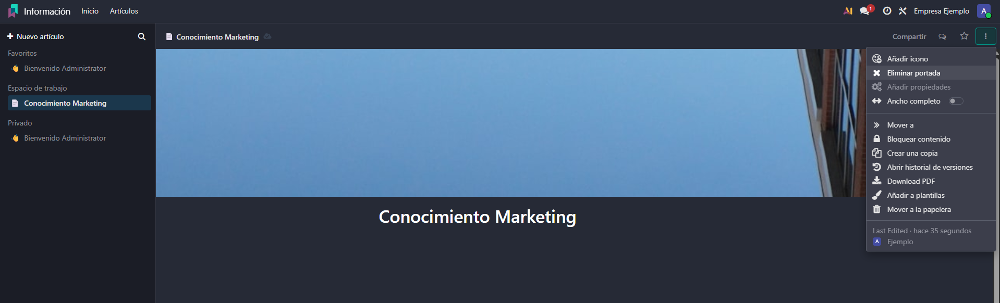

17. Podemos **anidar** más espacios de trabajo dándole al icono correspondiente:

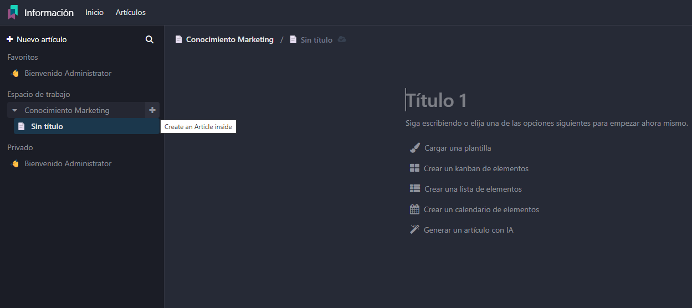

18. Con la barra **"/"** podemos **escribir distintos comandos** que nos facilitan con una lista. Por ejemplo un índice, texto, código, tablas y muchas más cosas

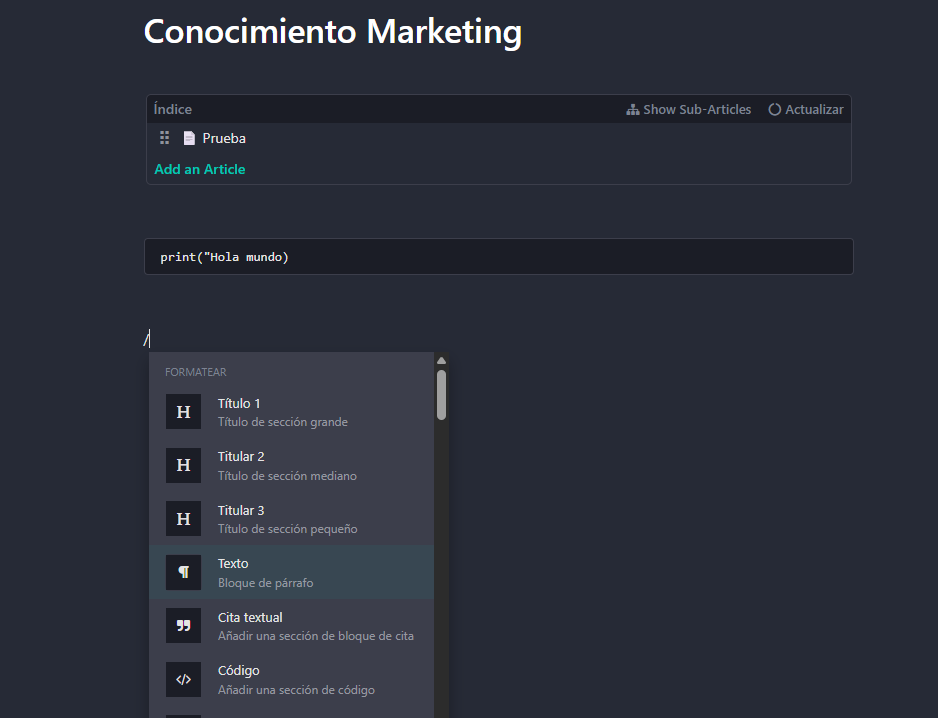

19. Si le damos arriba a la derecha a **Compartir**, podemos **modificar los permisos** para los demás usuarios que accedan.

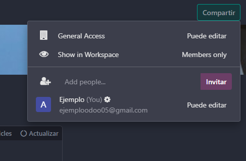
