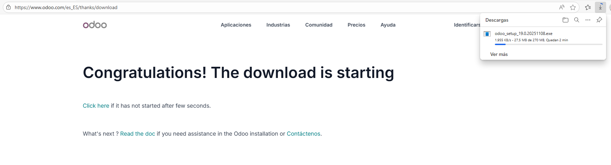
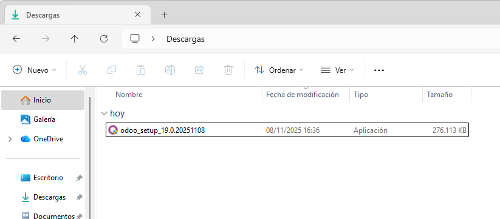

# 03 — Descarga del instalador de Odoo

## Pasos a seguir

1. Nos dirigimos a la [web oficial de Odoo](https://www.odoo.com/es_ES/page/download) y localiza el **instalador para Windows** para Odoo 19. Instalamos la versión **Community**. Antes debemos **rellenar información** de la empresa y sobre nosotros.

2. Si lo hemos hecho todo correctamente nos aparecerá esta pantalla y el **archivo de instalación descargándose**.

3. Comprobamos yendo a **Descargas** en el **Explorador de archivos**.

