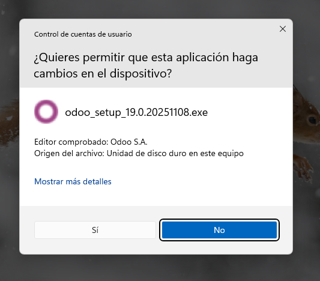
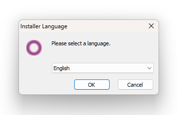
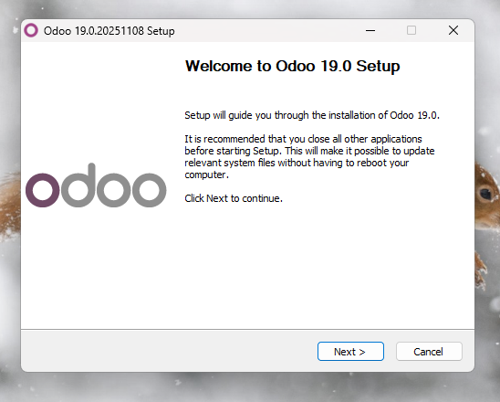
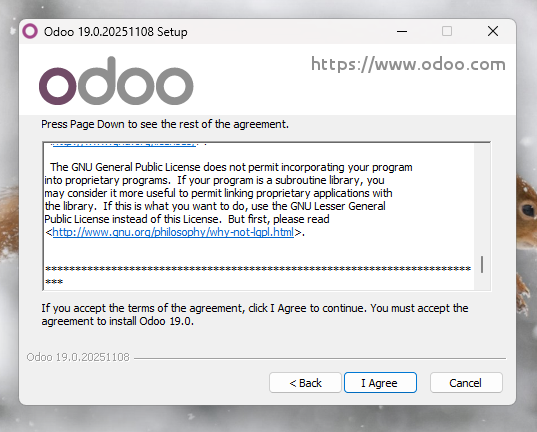
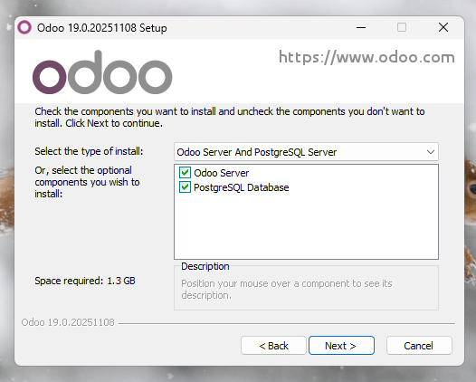
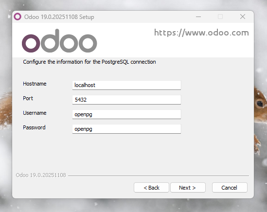
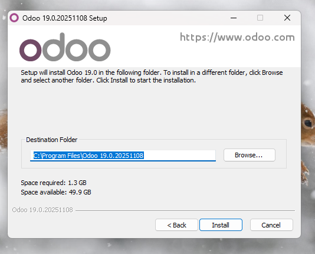
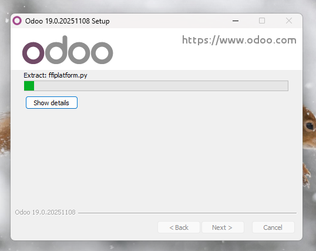
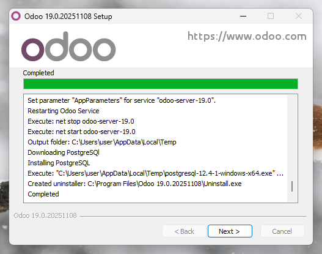
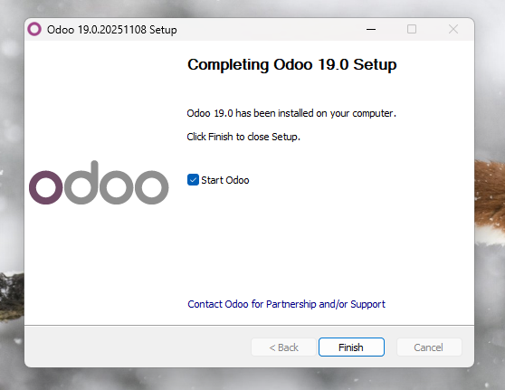

# 05 — Instalación de Odoo

1. Ejecutamos el instalador (`.exe`) como **Administrador**. Nos aparecerá este mensaje para permitir que haga cambios en el dispositivo. Le decimos que **Sí**.

2. Seleccionamos el **idioma**.

3. Nos da la **bienvenida**.

4. Leemos los **términos** y decimos que estamos de acuerdo "**I agree**".

5. **PASO IMPORTANTE**. Nos aseguramos de que instalamos **Odoo Server** y **PostgreSQL Server**: tienen que estar los dos opciones marcadas con un tic verde.

6. **Configuramos** la **conexión** de PostgreSQL. 

> **Recomendación**: *Username* y *Password* sean **iguales**

7. Finalmente **instalamos Odoo**. No tenemos por qué cambiar la ruta.

8. Esperamos a que se **instale por completo**. Acto seguido continuamos con el procedimiento.

9. Le damos a **Finish** y nos ejecutará Odoo en la web con un **puerto local**, por defecto **8069**. En el punto [08-Creación de base de datos de prueba](./08-creacion_bd_prueba.md) crearemos la primera **base de datos**.

