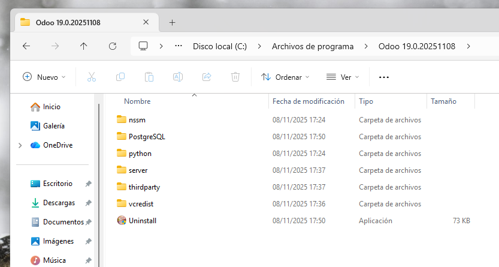
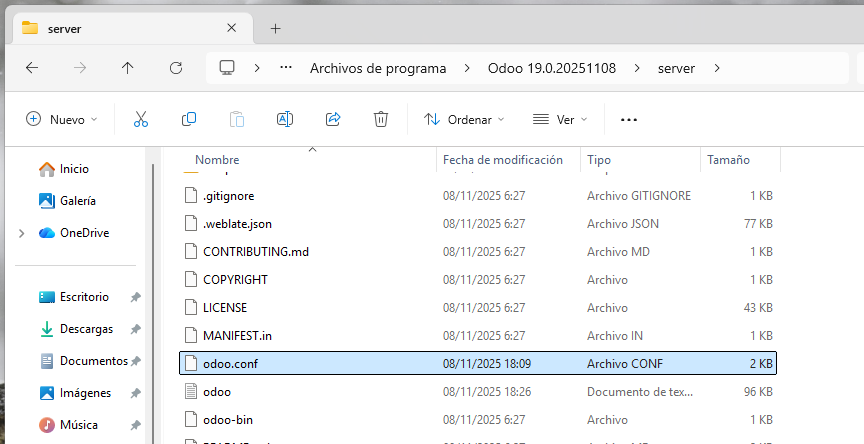
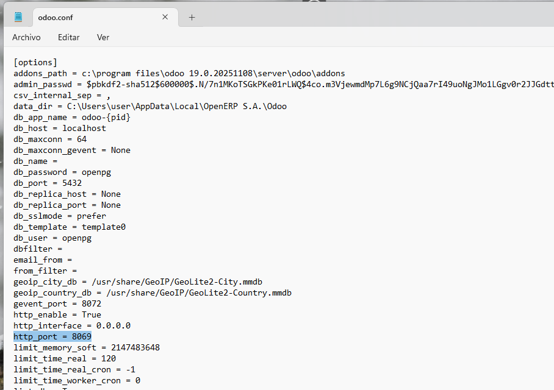

# 06 — Configuración inicial

1. Abrimos el explorador de archivos en una ruta parecida a esta (la misma que nos indicó en la [instalación](./05-instalacion_odoo.md), punto 7): `C:\Program Files\Odoo 19.0.20251108`.

2. Entramos en la carpeta `server` y **localizamos** el archivo `odoo.conf`.

3. **Abrimos** el **archivo de configuración** y en él encontramos entre otros muchos datos, el **puerto local de Odoo**: el 8069. Además de otros parámetros iniciales como los **datos de la conexión de la base de datos** Postgres que definimos en la instalación. Para ajustar idioma y zona horaria, se hace desde la interfaz web, no desde este archivo.

4. Con esta información, debemos saber que la **URL de acceso local** es: 

	- `http://localhost:8069`
