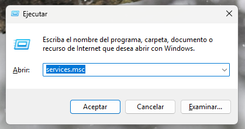
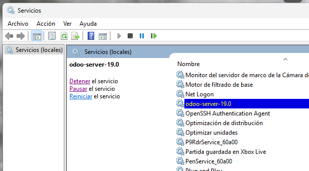
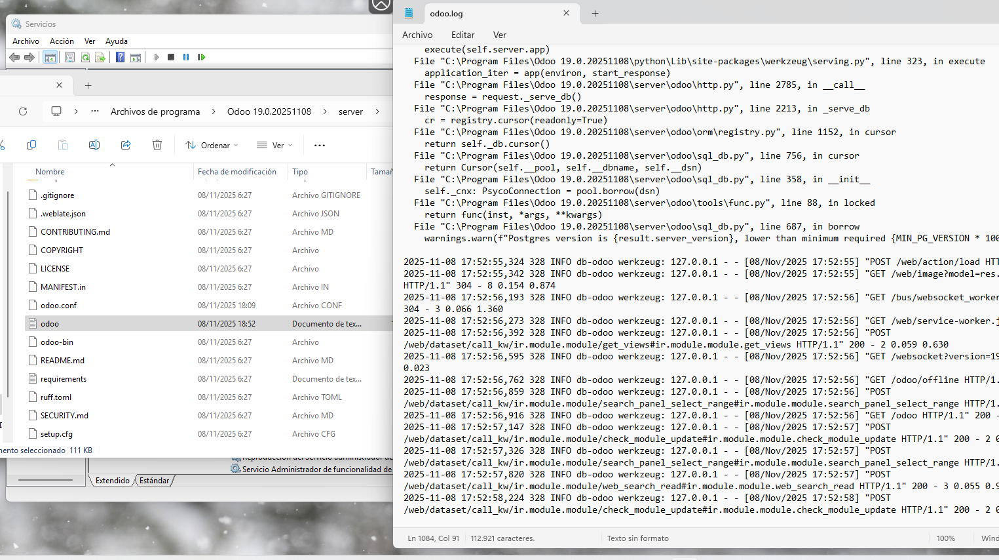

# 07 — Ejecución y servicio

1. Para activar, desactivar o detener el servicio de Odoo, necesitamos entrar en los servicios de Windows. El primer paso será pulsar **`Windows+R`** en el cuadro que nos aparecerá abajo a la izquierda escribimos **`services.msc`**.

2. Localizamos el servicio de **Odoo Server**. Tendrá un nombre como "**odoo-server-19.0**". Y una vez pulsado en él podremos detener, pausar, reiniciar e iniciar el servicio. Actualmente está **iniciado**. Podemos **acceder al servicio** con `http://localhost:8069` en el navegador.

3. También es importarte localizar el archivo de logs de Odoo. Para ello, nos vamos al directorio `C:\Program Files\Odoo 19.0.20251108\server\` y habrá un archivo llamado `odoo` u `odoo.log`, puede estar justo debajo del de configuración.

