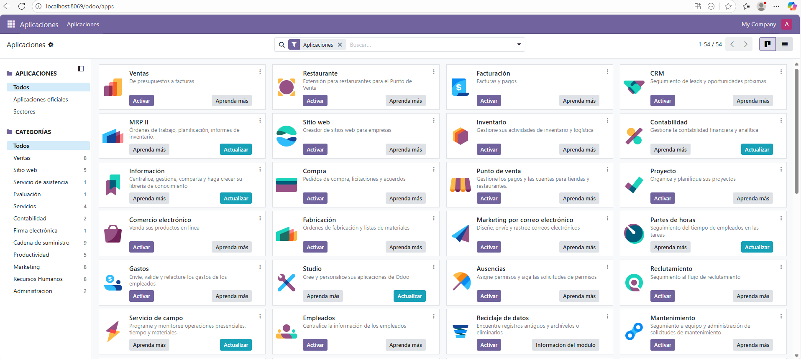
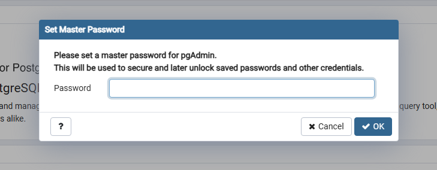
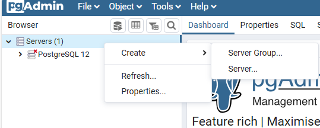
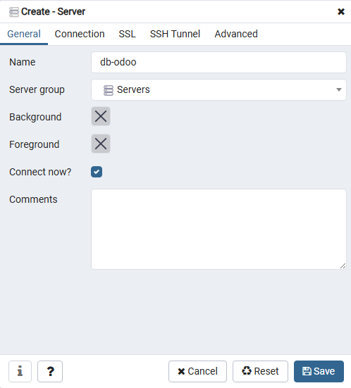
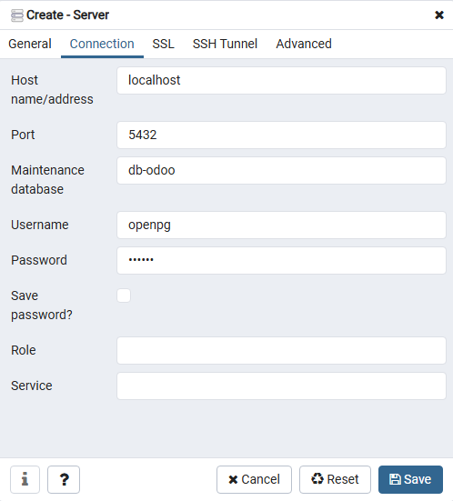
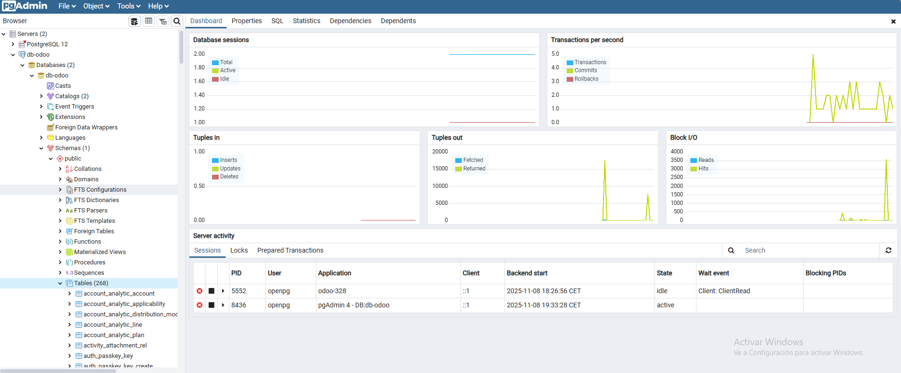

# 08 — Creación de base de datos de prueba

## Índice

- [Creación de base de datos](#creación-de-base-de-datos)
- [Acceso a la base de datos](#acceso-a-la-base-de-datos)

## Creación de base de datos

1. Una vez hayamos **entrado** a la URL de Odoo en local `http://localhost:8069`, lo primero que nos aparece es para **crear una base de datos**. Rellenamos los campos y la creamos.

2. Una vez creada, ya tenemos acceso a las **aplicaciones de Odoo**. Para instalar una, le damos a **"Activar"**. Y para cambiar entre distintos módulos. Le damos al menú de los nueve cuadrados situado arriba a la izquierda.

## Acceso a la base de datos

3. Abrimos **pgAdmin** que se nos instaló junto con Odoo. Nos pedirá lo primero de todo establecer una **contraseña maestra**.

> Recomendación de contraseña: *pgAdmin* o *pgadmin*

4. Hacemos clic derecho al desplegable de **Servers** > **Create** > **Server...**

5. Nos abre esta ventana, en el apartado de **General**, nombramos a la conexión como a la base de datos que creamos en el **punto 1**.

6. En el apartado de **Connection**, nombramos el **host** (localhost), el **puerto** (5432), el **nombre de la base de datos**, anteriormente creada, y el nombre de **usuario y contraseña** que dimos en el apartado [05-Instalación de Odoo](./05-instalacion_odoo.md), **punto 6**.. Lo demás no hace falta tocarlo. Y finalmente le damos a "**Save**".

7. Ya tenemos **acceso a la base de datos** recientemente creada.

