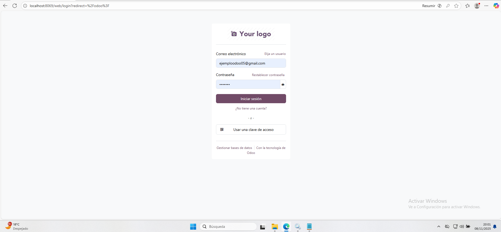
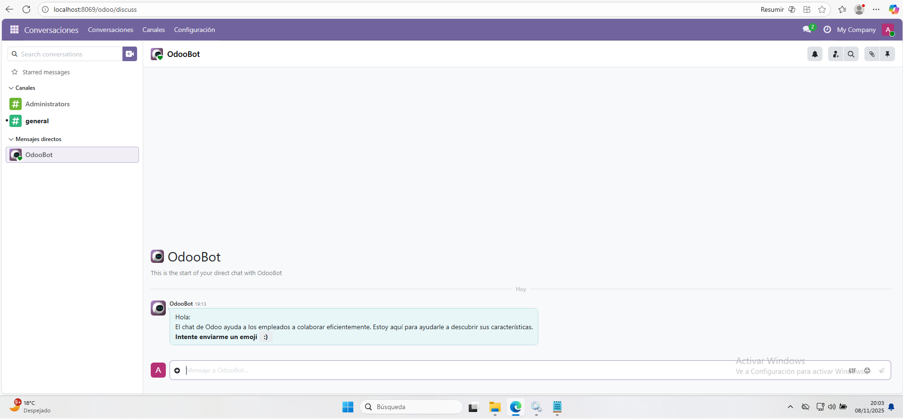

# 09 — Verificación de acceso

1. **Cierro sesión** y voy al **Login**.

2. Inicio sesión con el **correo y contraseña** que puse al **crear la base de datos** y me abre el **dashboard de un módulo**.

