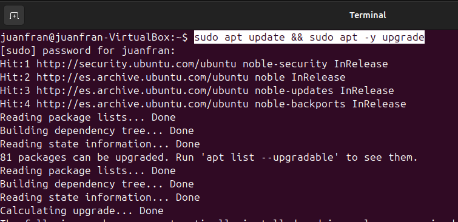
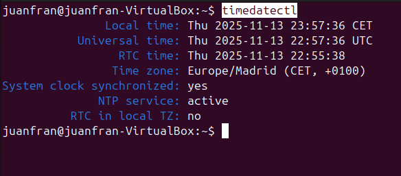
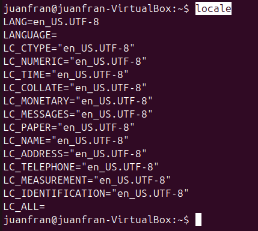

# 03 — Preparación del sistema

1. Actualiza **índices y paquetes**:

   ```bash
   sudo apt update && sudo apt -y upgrade
   ```
   

2. Configura **zona horaria e idioma** si procede.

   Para obtener datos de la zona horaria, ejecutamos:

   ```bash
   timedatectl
   ```

   

   Para cambiar la zona horaria en el caso que queramos cambiarla, ejecutamos (cambiando la zona horaria por la que queramos cambiar):

   ```bash
   sudo timedatectl set-timezone Europe/Madrid
   ```

   Para ver todas las variables de configuración regional (locales) que tu sistema está usando en ese momento, ejecutamos.

   ```bash
   locale
   ```

   
