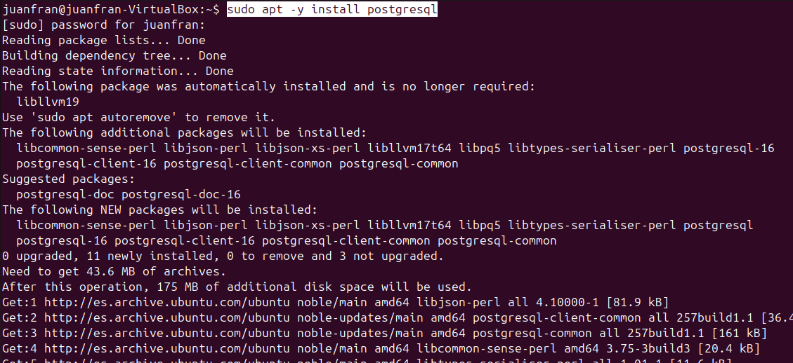
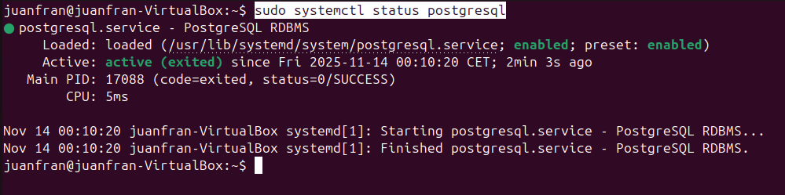
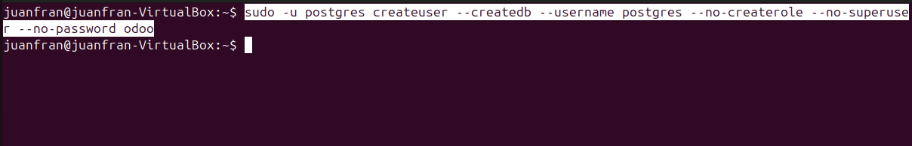
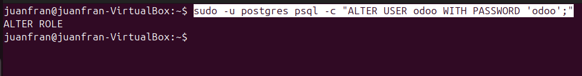
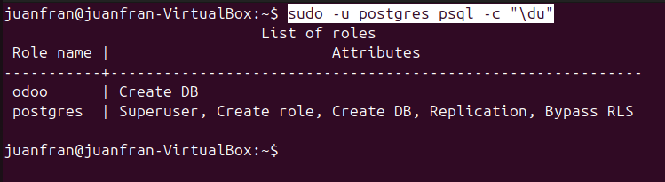

# 04 — PostgreSQL en Linux

## Índice

- [Instalación y verificación de PostgreSQL](#instalación-y-verificación-de-postgresql)
- [Rol para Odoo](#rol-para-odoo)

## Instalación y verificación de PostgreSQL

1. Instala **PostgreSQL** desde repos:

   ```bash
   sudo apt -y install postgresql
   ```

   

2. Verifica el **estado** del servicio:

   ```bash
   sudo systemctl status postgresql
   ```

   

## Rol para Odoo

3. Para crear un rol para Odoo, lo que haremos será lo siguiente: crear un usuario, darle una contraseña y permisos para crear bases de datos. Ejecutando el siguiente código, crearás el usuario ``odoo`` con el permiso de **crear bases de datos**.

   ```bash
   sudo -u postgres createuser --createdb --username postgres --no-createrole --no-superuser --no-password odoo
   ```

   

4. Le asignamos una **contraseña** al nuevo usuario:

   ```bash
   sudo -u postgres psql -c "ALTER USER odoo WITH PASSWORD 'odoo';"
   ```

   

5. **Verificamos los usuarios** de PostgreSQL. Nos encontramos con el usuarios postgres que viene por defecto con todos los permisos, y luego está el que acabamos de crear, con el **permiso de que puede crear bases de datos**.

   ```bash
   sudo -u postgres psql -c "\du"
   ```

   
