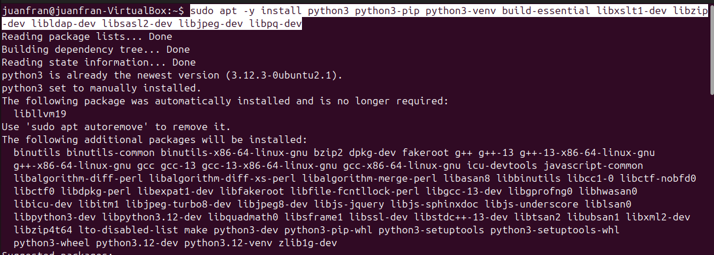
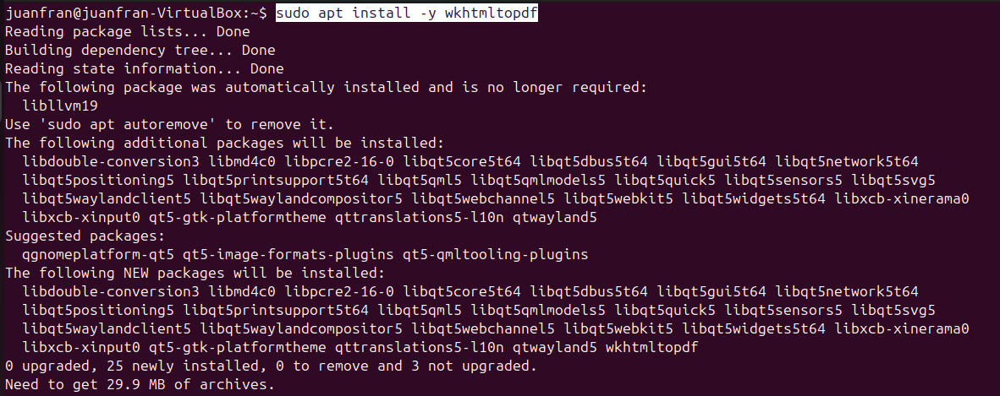
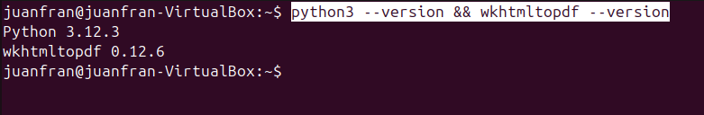

# 05 — Dependencias (Python, wkhtmltopdf, librerías)

1. Instala Python y paquetes de compilación:

   ```bash
   sudo apt -y install python3 python3-pip python3-venv build-essential libxslt1-dev libzip-dev libldap2-dev libsasl2-dev libjpeg-dev libpq-dev
   ```

   

2. Instala **wkhtmltopdf** compatible (para reportes PDF).

   ```bash
   sudo apt install -y wkhtmltopdf
   ```

   

3. **Verificar** versiones:

   ```bash
   python3 --version && wkhtmltopdf --version
   ```

   
