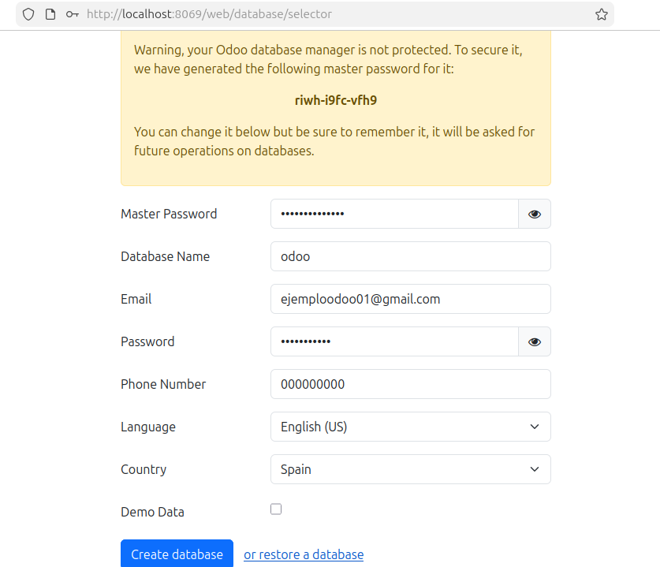
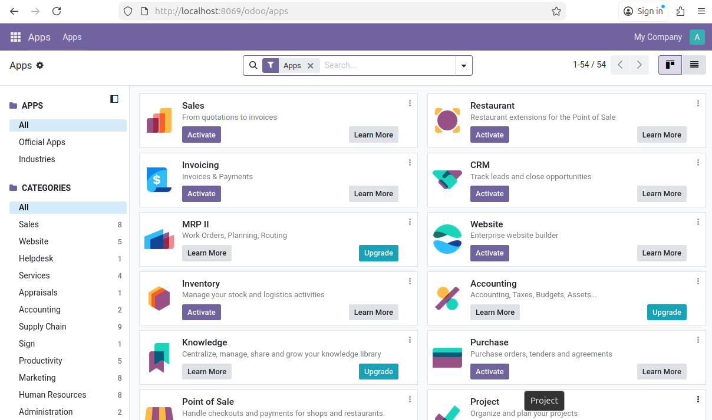

# 09 — Creación de base de datos de prueba

1. Accede a `http://localhost:8069`.

2. Crea una **base de datos nueva** con email/contraseña admin.

    

3. Selecciona módulos iniciales si procede. En la pantalla de la siguiente imagen podremos instalar más módulos a parte de los que vienen por defecto.

    
